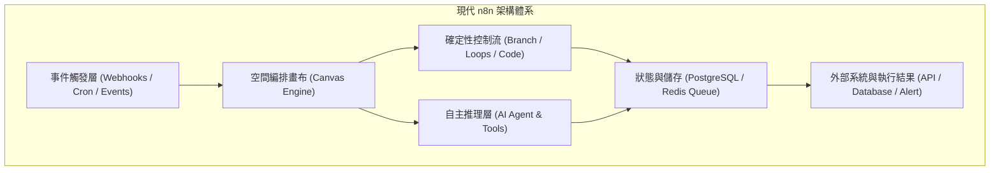

# 01. 什麼是 n8n？2026 現代自動化全貌與核心架構

自動化技術在過去十年間經歷了從「批次腳本 (Cron Scripts)」、「商業閉源 iPaaS (Zapier / Make)」到「現代開源編排引擎」的三次重要演進。進入 2026 年，隨著 **n8n 2.x 與 3.x** 的全面成熟，n8n 已經成為全球工程師與企業技術團隊建構工作流、串接 API 與編排 AI Agent 的首選基礎設施。


**核心定位**  
n8n 是一款基於節點（Node-based）、採用 Fair-code 授權的現代化工作流自動化與 AI 編排系統。它兼具無程式碼（No-Code）的直觀視覺化畫布，以及全程式碼（Full-Code）的極致靈活性（原生支援 JavaScript 與 Python）。


---

## 一、n8n 在 2026 年的現代架構演進

在 2024 年以前，自動化工具主要解決的是「線性搬運資料」的任務。然而，面對微服務普及與大語言模型（LLM）的爆發，傳統工具逐漸面臨瓶頸：

### 1.1 n8n 2.x/3.x 的核心重大躍升

1. **草稿與發布機制 (Separation of Save & Publish)**：
   在早期版本中，畫布上的任何變動若經儲存，線上執行立即受到影響。自 n8n 2.0 起，正式導入現代軟體工程的 Draft/Publish 分離架構。工程師可自由修改、測試草稿，僅在確認無誤後點擊「Publish」上線，並支援隨時「一鍵回滾 (Rollback)」至歷史版本。
2. **AI Agent 一等公民 (AI as First-Class Citizen)**：
   AI 節點不再只是附加的外掛，而是深入引擎底層。AI Agent 節點原生支援主流大模型（Claude 3.5/3.7、GPT-4o、Google Gemini 2.0/1.5 等）的 Function Calling / Tool Calling 規範。
3. **全面容器化標準 (Mandatory Docker Standard)**：
   2026 年發布的 n8n 3.0 正式宣告放棄裸機 `npm install` 部署方式，全面轉移為 Docker / OCI 容器標準，以確保底層 Python/Node.js 隔離沙盒與執行安全。
4. **高效能儲存與連線池優化**：
   底層引擎徹底重構了 PostgreSQL 連線池與 SQLite 併發驅動，在高負載情境下吞吐量提升了 300% 以上。

---

## 二、n8n vs Zapier vs Make 深入架構對比

企業在評估自動化方案時，往往在 Zapier、Make 與 n8n 之間抉擇。下表為 2026 年最新技術維度分析：

| 評估維度 | n8n (2026 自託管/雲端) | Zapier | Make (前身 Integromat) |
| :--- | :--- | :--- | :--- |
| **部署型態** | **開源自託管 (Docker) / 官方雲** | 僅支援 SaaS 雲端 | 僅支援 SaaS 雲端 |
| **資料隱私與合規** | **100% 資料本機落地 (符合 GDPR/HIPAA)** | 資料皆託管於第三方平台 | 資料皆託管於第三方平台 |
| **計費模式** | **工作流執行次數計費 / 自託管無限次** | 依 Task 逐筆計價（高頻昂貴）| 依 Operation 計價 |
| **自訂代碼支援** | **原生支援 JavaScript & Python** | 僅支援微型 Python/JS 腳本 | 不支援直接編寫腳本 |
| **AI Agent 編排** | **原生 LangChain 體系、Tool Calling、RAG** | 基礎 AI Action（難自訂記憶/工具）| 基礎 AI Action |
| **高併發擴展** | **Redis Queue Mode 橫向擴展 Worker** | 依賴平台黑盒排隊 | 依賴平台黑盒排隊 |
| **版本控管 (CI/CD)**| **支援 Git Sync、JSON 匯出、REST API** | 無原生 Git 整合 | 需 Enterprise 方案支援 |


**架構師選型結論**  
若您的業務場景涉及**內部敏感資料、高頻高併發資料搬運、客製化腳本運算**，或是需要建構**自主決策的 AI Agent 系統**，自託管 n8n 是目前業界最具性價比與擴展性的現代化方案。


---

## 三、Fair-Code 授權與合規須知

n8n 採用 **Sustainable Use License (公平代碼 Fair-code)**：
- **內部業務使用 (Internal Business Use)**：完全免費！您可以無限在企業內部伺服器架設、自動化所有內部系統與客服流程。
- **原始碼開放 (Source-Available)**：所有核心代碼均可在 GitHub 上審查、審計與客製構建。
- **商業轉售限制**：若您打算將 n8n 的自動化能力打包成「多租戶商業自動化產品 (White-label SaaS)」直接向最終用戶收費，則需向官方取得商業授權。

---

## 四、本章總結

在 2026 年，學習 n8n 不僅僅是學習一款工具，而是掌握一套**現代分散式事件驅動架構**與**AI Agent 編排邏輯**。在下一章中，我們將透過標準 Docker Compose，在 3 分鐘內啟動您的第一台生產級 n8n 實例。
