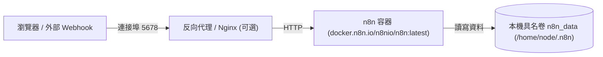

# 02. 快速起步：Docker 與 Docker Compose 一鍵部署

在 2026 年，官方已全面規範以 **Docker 容器化** 作為 n8n 自託管唯一支援的生產標準。容器化不僅解決了底層依賴衝突，更能確保 Python / JavaScript 腳本沙盒在隔離環境中安全運行。

本章將引導您透過 `docker-compose.yml` 於 3 分鐘內啟動一個穩固、資料持久化的 n8n 實例。

---

## 一、標準部署架構概覽




**關鍵安全提示：N8N_ENCRYPTION_KEY**  
n8n 會在初次啟動時自動產生加密金鑰以儲存各項 API 憑證。**強烈建議在啟動前手動指定自訂的 `N8N_ENCRYPTION_KEY`**。若遺失此金鑰或未持久化，重新部署容器後將無法解密過去建立的所有密碼與 OAuth Token！


---

## 二、編寫 Docker Compose 檔案

在專案目錄或伺服器目錄中，建立 `docker-compose.yml`：

```yaml
version: '3.8'

services:
  n8n:
    image: docker.n8n.io/n8nio/n8n:latest
    container_name: n8n-automation
    restart: unless-stopped
    ports:
      - "5678:5678"
    environment:
      # 基礎站點設定
      - N8N_PORT=5678
      - N8N_PROTOCOL=http
      - WEBHOOK_URL=http://localhost:5678/
      - GENERIC_TIMEZONE=Asia/Taipei
      
      # 安全與金鑰（請自行替換為隨機安全字串）
      - N8N_ENCRYPTION_KEY=my_ultra_secure_secret_key_2026_x!
      
      # 2026 安全隔離沙盒 (預設開啟)
      - N8N_RUNNERS_ENABLED=true
      
      # 執行紀錄保存天數 (避免 SQLite 膨脹)
      - EXECUTIONS_DATA_PRUNE=true
      - EXECUTIONS_DATA_MAX_AGE=168 # 保存 7 天 (小時)
    volumes:
      - n8n_data:/home/node/.n8n

volumes:
  n8n_data:
    external: false
```

---

## 三、部署操作步驟 (Stepper)



### 步驟 1：建立部署目錄與 Compose 檔案
在終端機建立工作目錄並將上述設定存為 `docker-compose.yml`：

```bash
mkdir -p ~/n8n-deploy && cd ~/n8n-deploy
# 將上方 yaml 內容寫入 docker-compose.yml
```



### 步驟 2：背景啟動 n8n 容器
執行 Docker Compose 指令拉取映像並於背景運行：

```bash
docker compose up -d
```

檢查容器運作狀態：
```bash
docker compose ps
docker compose logs -f n8n
```
當日誌輸出 `Editor is now accessible via: http://localhost:5678/` 即代表啟動成功。



### 步驟 3：初次登入與設定 Owner 帳號
打開瀏覽器訪問 `http://localhost:5678`：
1. 輸入**管理員電子信箱 (Email)** 與 **安全密碼 (Password)**。
2. 填寫團隊或個人名稱。
3. 系統將自動初始化管理員（Owner）權限，並進入全新空間畫布介面！



---

## 四、跨平台注意事項



在 Linux 生產伺服器上，請確保已安裝 Docker Engine 與 Docker Compose Plugin：
```bash
sudo apt-get update && sudo apt-get install -y docker-ce docker-compose-plugin
sudo systemctl enable --now docker
```
建議搭配 Nginx 或 Caddy 配置 SSL 證書，並將 `WEBHOOK_URL` 設為 HTTPS 網域名稱。



在開發者個人電腦上，推薦使用 **Docker Desktop**：
- Windows 用戶請務必啟用 **WSL 2 Integration**（於 Docker Desktop 設定 -> Resources -> WSL Integration 勾選您正在使用的 Linux 發行版）。
- 可直接以 `http://localhost:5678` 進行本機工作流開發。



---

## 五、關鍵環境變數參考表

下表列出 2026 現代 n8n 最重要的核心環境變數：

| 變數名稱 | 預設值 | 建議生產設定 | 用途說明 |
| :--- | :--- | :--- | :--- |
| `WEBHOOK_URL` | 空 | `https://n8n.yourdomain.com/` | 外部服務回調與觸發的公開 URL，不可為 localhost |
| `N8N_ENCRYPTION_KEY` | 自動生成 | **自訂隨機 32 位以上字串** | 憑證資料庫加密金鑰，必須持久化保存 |
| `GENERIC_TIMEZONE` | `America/New_York` | `Asia/Taipei` (或對應時區) | 控制 Cron 排程與工作流時間計算基準 |
| `N8N_RUNNERS_ENABLED` | `true` | `true` | 啟用隔離的任務執行器，防止 Code 節點耗盡主進程資源 |
| `EXECUTIONS_DATA_PRUNE` | `false` | `true` | 定期清理過期的歷史執行記錄，避免資料庫崩潰 |

在下一章中，我們將登入 n8n 畫布，全面解析 2026 年最具突破性的**空間畫布**與**草稿發布機制**。
