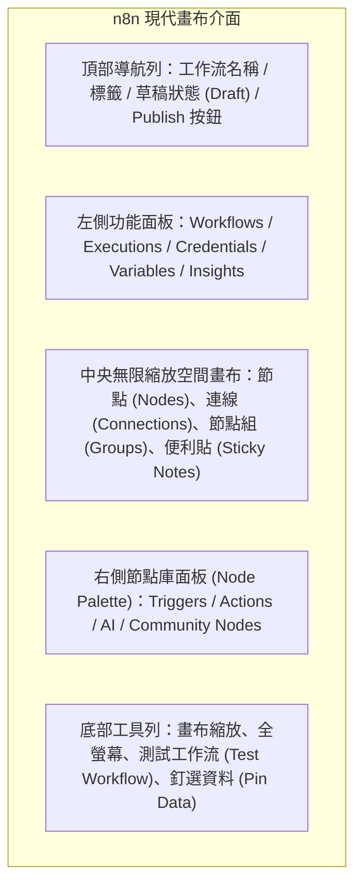
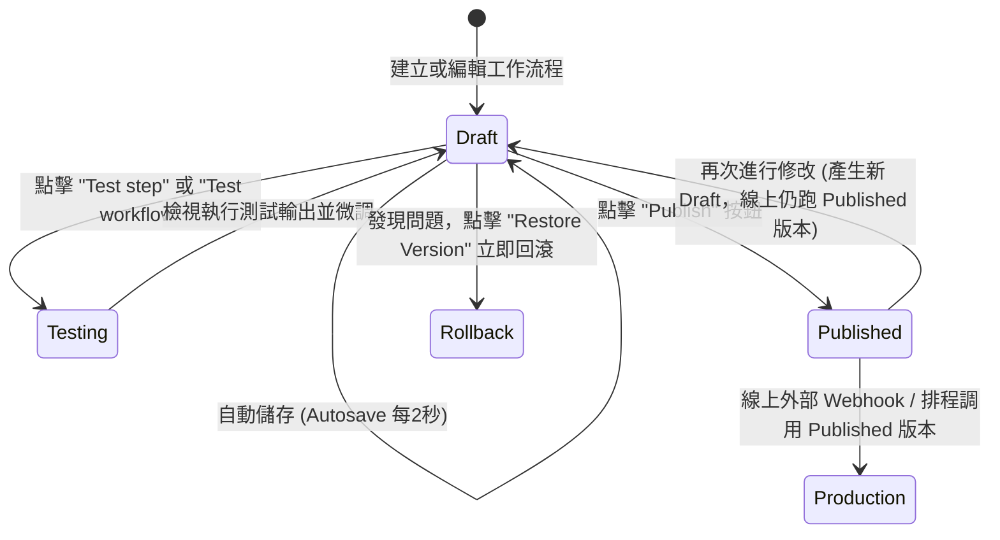

# 03. 全新空間畫布與介面導覽（草稿、發布與自動儲存）

進入 n8n 的世界，您首先映入眼簾的是現代化的**空間畫布 (Spatial Canvas)**。自 n8n 2.x 起，編輯器經歷了徹底的重構，不僅支援大規模複雜流程的節點分組，更將軟體工程的核心思想——「**草稿、版本控制、一鍵發布與回滾**」深度融入使用者體驗中。

---

## 一、空間畫布核心區域劃分

### 1.1 畫布常用快捷鍵 (2026 高效指南)
- `Tab` 或 `Space`：快速在游標所在處呼叫新增節點面板（Node Palette）。
- `Ctrl / Cmd + S`：手動保存為最新草稿（Draft）。
- `Ctrl / Cmd + D`：複製所選節點。
- `Delete / Backspace`：刪除選取之節點或連線。
- `Shift + 滑鼠左鍵拖曳`：框選多個節點，並可右鍵選擇「**Group Nodes into Sub-Cluster**」進行群組管理。

---

## 二、草稿與發布機制 (Save vs Publish) 深度解析

這是 2026 年最受企業級用戶讚譽的現代架構變革。


**歷史舊版 vs 現代 2.x/3.x 行為差異**  
- **舊版行為**：只要工作流程處於「Active」狀態，畫布上的任何即時編輯一旦點擊儲存，外部真實 Webhook 流量就會立即執行修改中的代碼，極易造成線上事故。
- **現代機制**：**草稿 (Draft)** 與 **線上已發布版本 (Published)** 徹底隔離！


### 2.1 自動儲存 (Autosave) 機制
在現代編輯器中，內建了每 2 秒自動儲存（Autosave）機制。即使瀏覽器崩潰或網路斷線，您的每一步連線與表達式調整都會自動保留在草稿記錄中，不再有忘記按存檔導致勞動成果消失的風險。

### 2.2 版本歷史與一鍵回滾 (Version History & Rollback)
點擊頂部狀態列的「**Version History**」：
1. 系統詳細記錄每一次發布（Publish）的時間、操作者及變更差異（Diff）。
2. 若新發布的業務邏輯異常，只需點擊歷史版本旁的「**Restore to this version**」，線上生產環境將在 0.1 秒內無縫切回前一穩定版本。

---

## 三、節點狀態與資料釘選 (Pin Data)

在畫布上，每個節點均具備多種運行狀態，善用這些狀態能大幅提升開發與除錯效率：

| 節點圖示/狀態 | 功能說明 | 適用情境 |
| :--- | :--- | :--- |
| **Active (正常運作)** | 正常隨工作流觸發與執行 | 正常線上業務流 |
| **Disabled (已停用)** | 該節點被略過，資料直接穿透或中斷該分支 | 暫時除錯或下線某段通知通道 |
| **Pinned Data (資料釘選)** | 固定儲存某次測試的輸出 JSON 資料 | **核心推薦**：開發下游節點時，無需重複呼叫外部收費 API 或等待真 Webhook |
| **Draft Modified (草稿變更)**| 該節點設定已變更，但尚未發布至生產環境 | 提醒開發者有未上線的修改 |


**資料釘選 (Pin Data) 最佳實踐**  
當您透過 Webhook 或收費的 OpenAI API 取得一筆真實的回應後，在節點輸出面板右上角點擊「**Pin Data**」。後續在設計 Filter、Code 節點或資料庫寫入時，下游節點皆可直接使用該筆已釘選的資料進行測試，完全不用耗費 API Token 或重複觸發第三方事件！


---

## 四、本章總結

掌握了空間畫布、草稿發布與資料釘選機制後，您已具備了現代 n8n 開發者的專業操作基礎。在下一篇中，我們將深入剖析 n8n 引擎最核心的心臟部位——**底層資料流結構與 `pairedItem` 溯源原理**。
