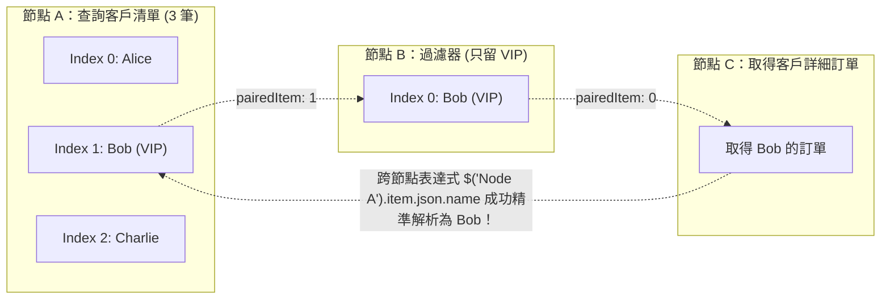

# 04. 核心資料結構：Array of JSON Objects 與 pairedItem 溯源機制

在深入任何自動化流程前，理解 n8n 底層的**資料結構規範**與**資料關聯追溯機制**是避免絕大多數詭異 Bug 的最關鍵一步。許多初學者在從其他平台轉向 n8n 時，常會困惑：「為什麼我的資料明明只有一筆，它卻總是用陣列包裝？」以及「為什麼跨節點取值時有時候會拿錯甚至報錯？」。

本章將徹底拆解 n8n 引擎內部的心臟運作原理。

---

## 一、通用資料結構：Array of Items

在 n8n 中，所有節點之間傳遞的資料**無一例外**都是一個陣列（Array），陣列中的每個元素稱為一個 **Item**（項目）。

```json
[
  {
    "json": {
      "id": 1001,
      "name": "Alex Chang",
      "email": "alex@example.com",
      "role": "Admin"
    },
    "binary": {
      "avatar": {
        "data": "....base64 data....",
        "mimeType": "image/png",
        "fileName": "avatar.png",
        "fileSize": "14.2 kB"
      }
    }
  },
  {
    "json": {
      "id": 1002,
      "name": "Sarah Lin",
      "email": "sarah@example.com",
      "role": "User"
    }
  }
]
```

### 1.1 核心組成要素
1. **`json` 鍵（必備）**：
   包含該項目的所有結構化欄位資料（數字、字串、物件、陣列）。在畫布表達式中，我們最常用的 `$json.fieldName` 讀取的就是這個物件底下的內容。
2. **`binary` 鍵（可選）**：
   當處理二進位二級檔案（如 PDF 報告、Excel 試算表、音訊、圖片）時，檔案的二進位資料或暫存參照會存放於 `binary` 底下，與 `json` 中繼資料並行傳遞。


**為什麼設計為 Item 陣列？**  
這種架構賦予了 n8n 天生的**批次處理能力**。當上游節點（例如查詢資料庫）回傳 100 筆客戶記錄時，下游的「發送 Slack 訊息」節點無需人為編寫 `for` 迴圈，引擎會**自動針對這 100 個 Item 循序或併發執行 100 次發送操作**！


---

## 二、Item Linking 與 pairedItem 溯源機制

既然每個節點都在處理 Item 陣列，那麼當資料在工作流中經過「過濾 (Filter)」、「分拆 (Split)」、「聚合 (Aggregate)」或「Code 節點重組」時，引擎如何知道下游的第 3 個 Item 究竟對應上游第幾個 Item？

這就是 **Item Linking (項目鏈接)** 與 **`pairedItem`** 發揮作用的地方。



### 2.1 為什麼需要 `pairedItem`？
當您在「節點 C」中使用語法：
```javascript
$('Node A').item.json.name
```
請注意，此處使用的不是 `first()` 也不是寫死 index，而是 `.item`！
引擎是如何精準找到「Bob」而不是「Alice」的？答案就是節點 C 沿著 `pairedItem` 的指針鏈條逆向溯源，找到該筆資料是由節點 B 的第 0 筆產生，而節點 B 的第 0 筆又是來自節點 A 的第 1 筆（Bob）。

---

## 三、Code 節點中維護 pairedItem 的最佳實踐

在內建標準節點（如 Edit Fields、Filter、HTTP Request）中，n8n 會自動在底層幫您維護 `pairedItem`。但當您在 **Code 節點** 中透過 JavaScript 自行構造、拆解或產生物件時，如果不保留 `pairedItem`，鏈條就會斷裂（Broken Chain），導致下游跨節點引用報錯！

### 3.1 錯誤示範：遺失 pairedItem
```javascript
// ❌ 錯誤寫法：直接返回全新物件，下游節點無法向上溯源！
return $input.all().map(item => {
  return {
    json: {
      transformedEmail: item.json.email.toLowerCase()
    }
  };
});
```

### 3.2 正確示範：保留 pairedItem 溯源資訊
```javascript
// ✅ 最佳實踐：明確指定 pairedItem，建立精準鏈接！
return $input.all().map((item, index) => {
  return {
    json: {
      transformedEmail: item.json.email.toLowerCase(),
      processedAt: new Date().toISOString()
    },
    pairedItem: {
      item: index // 關聯至當前輸入項目的索引
    }
  };
});
```


**一對多拆解時的 pairedItem 標記**  
若您將 1 個包含 5 筆訂單明細的 Item 拆解為 5 個獨立 Item，這 5 個輸出的 `pairedItem` 的 `item` 都應該指向 `0`（原輸入的那 1 個 Item）。這樣所有明細在後續需要向上取得原發票總檔資訊時，依然能完美匹配！


---

## 四、本章總結

1. n8n 節點間傳遞的本質始終是 `Array of Items`，每個 Item 封裝了 `json` 與可選的 `binary`。
2. 引擎透過 `pairedItem` 機制在節點之間串起血統鏈條（Lineage Chain），讓 `$('Node').item` 跨節點取值能夠自動對齊。
3. 在自訂 Code 節點進行資料變更或拆解時，主動維護 `pairedItem` 是高階自動化架構師的必備專業素養。

在下一章中，我們將探討驅動自動化引擎運轉的起點——**節點分類與觸發機制**。
