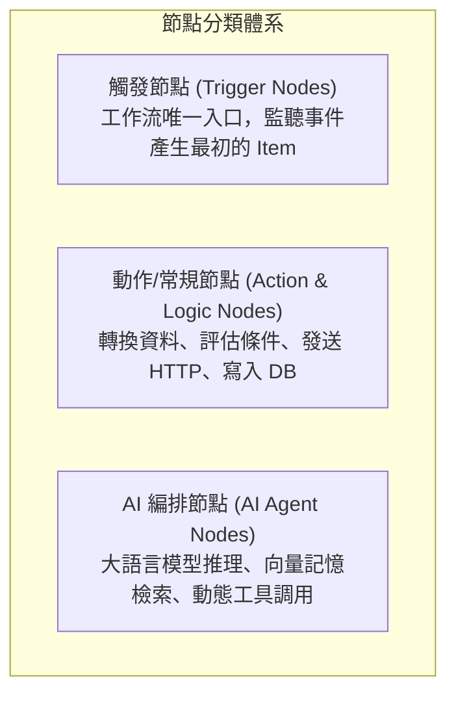
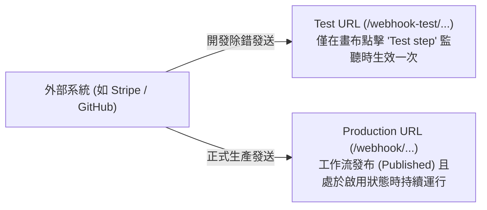
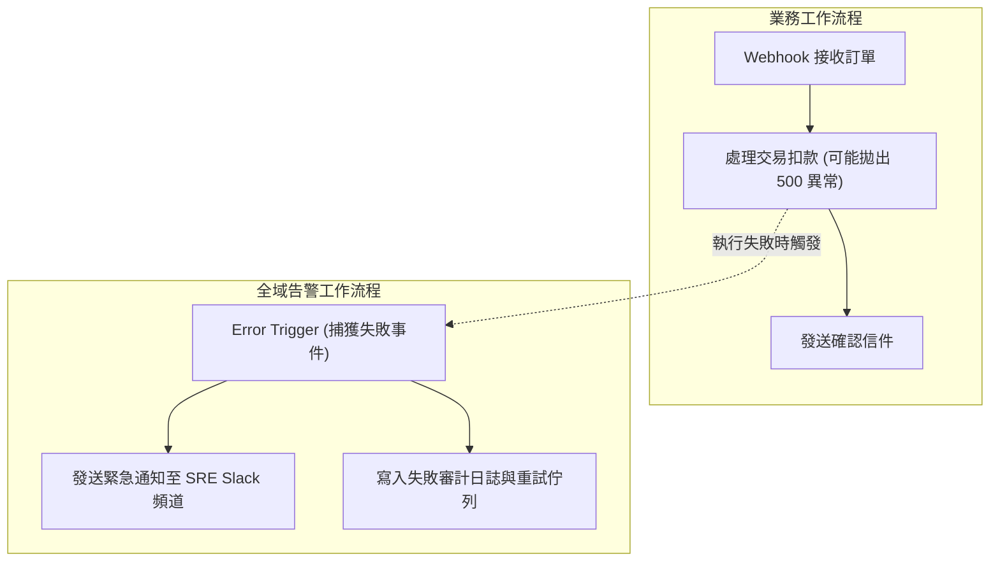

# 05. 節點分類與觸發機制（Webhook、Cron、Polling、Error Trigger）

在 n8n 的空間畫布中，所有自動化任務的起點與終點都由「**節點 (Nodes)**」構成。工作流的本質就是一個**有向無環圖 (DAG - Directed Acyclic Graph)**。深入掌握節點的分類特徵與觸發時機，是設計出具備容錯力、低延遲與高擴展性自動化架構的基石。

---

## 一、節點三大核心分類體系

在 2026 年的 n8n 中，節點依據其在架構中的職責可明確劃分為三大類：



### 1.1 觸發節點 (Trigger Nodes)
任何工作流程必須具備至少一個觸發節點（帶有雷電圖標 ⚡）。觸發節點負責監聽外部世界並產出最原始的 Item 陣列。
- **Webhook**：即時接收來自外部系統（Stripe, GitHub, Shopify）的 HTTP POST/GET 請求。
- **Schedule (Cron)**：依據設定的時間間隔或標準 Cron 表達式定時喚醒。
- **App Triggers (Polling / SSE / Webhook)**：應用專屬觸發器，如「當 Google Sheets 新增列」、「當 Gmail 收到信件」。
- **Error Trigger (全域錯誤捕獲)**：當特定工作流程發生未捕獲異常時，自動觸發執行的告警工作流。
- **Execute Workflow Trigger (子流程入口)**：被另一個上層工作流程調用時的進入點。

### 1.2 動作與常規節點 (Action Nodes)
接收上游節點輸入的 Item 陣列，對每個 Item 執行具體操作（例如查詢 PostgreSQL、呼叫外部 REST API、發送 Slack 訊息或寫入 Redis）。

### 1.3 AI 編排節點 (AI Nodes)
自 2025/2026 年起成為一等公民。包含 AI Agent、Embeddings、Vector Store、Chat Memory 與 Custom Tool 節點，可掛載於常規流程中執行語意理解與工具決策。

---

## 二、Webhook 節點的測試與生產雙機制

Webhook 是自動化整合中最常見的即時觸發方式。n8n 提供了一套貼心的雙重網址機制：




**常見新手陷阱：Test URL 與 404 錯誤**  
- **Test URL** 僅在您打開畫布編輯器、點擊了「**Listen for test event**」並處於等待狀態時才短暫有效。一旦接收到一筆資料並顯示在畫布上，該測試端點即立刻關閉！
- 若要讓外部系統永久呼叫，**必須使用 Production URL，且該工作流程必須處於「Published」且開關為「Active」狀態**。


---

## 三、Schedule (Cron) 定時觸發配置

Schedule 節點支援兩種常見模式：
1. **簡易間隔模式 (Interval)**：例如「每 15 分鐘」、「每天早上 8 點」。
2. **進階 Cron 表達式模式**：支援標準 5 欄位 Cron 語法。

```text
┌───────────── 分鐘 (0 - 59)
│ ┌───────────── 小時 (0 - 23)
│ │ ┌───────────── 日期 (1 - 31)
│ │ │ ┌───────────── 月份 (1 - 12)
│ │ │ │ ┌───────────── 星期 (0 - 6) (0 表示星期日)
│ │ │ │ │
* * * * *
```

- 範例：`0 9 * * 1-5` 代表每週一至週五上午 09:00 執行。
- **時區對齊**：預設採用環境變數 `GENERIC_TIMEZONE=Asia/Taipei`。亦可在 Schedule 節點的「Timezone」設定中單獨指定覆蓋。

---

## 四、全域錯誤處理架構：Error Trigger

在生產環境中，任何 API 呼叫都可能因網路抖動或服務端 500 而失敗。與其在每個節點手動配置錯誤捕捉，官方推薦採用**全域錯誤捕獲工作流 (Error Workflow)**。



### 4.1 如何綁定 Error Workflow？
1. 建立一個全新的獨立工作流程，以 **Error Trigger** 作為起始節點。
2. 在 Error Trigger 節點下游連接 Slack / Email 告警節點。Error Trigger 會自動接收包含：
   - 失敗工作流 ID 與名稱 (`$json.workflow.id`, `$json.workflow.name`)
   - 出錯節點名稱 (`$json.execution.error.node.name`)
   - 錯誤訊息與堆疊追蹤 (`$json.execution.error.message`)
3. 開啟原業務工作流程，點擊右上角工作流設定（Settings -> **Error Workflow**），選擇剛剛建立的告警工作流。
4. 一旦線上業務流程發生未處理之崩潰，n8n 會自動呼叫該告警流程，實現 100% 不漏接的系統監控！

---

## 五、本章總結

- 觸發節點是工作流的引擎源頭，決定了資料如何進入系統。
- Webhook 具有 Test 與 Production 雙環境，生產環境必須確保 Published 與 Active。
- 企業級架構應全面配置 Error Trigger 工作流，實現集中的異常捕獲與告警通報。

在下一章中，我們將學習在節點內部靈活萃取與操作資料的神兵利器——**現代表達式語法與 Luxon 時間處理**。
