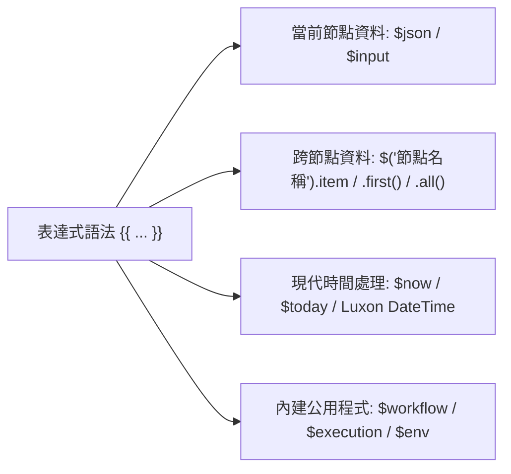

# 06. 現代表達式語法與 Luxon 時間處理實戰

在 n8n 中，**表達式 (Expressions)** 是連接各個節點資料流的紐帶。透過以雙大括號 `{{ ... }}` 包裹的 JavaScript 程式碼片段，您可以動態讀取上游資料、執行字串轉換、條件判斷以及複雜的時間運算。

自 n8n 1.0 起至 2026 年當前版本，官方全面淘汰了舊版 `$node["NodeName"].json` 語法，確立了以 `$('NodeName').item` 為核心的**現代表達式規範**。

---

## 一、現代表達式核心語法速查

在節點的任何設定輸入框中，切換至 **Expression** 標籤頁即可撰寫表達式：



### 1.1 常用表達式語法表

| 語法 | 作用 | 適用場景 |
| :--- | :--- | :--- |
| `{{ $json.fieldName }}` | 讀取當前輸入項目的特定欄位 | 絕大多數日常取值 |
| `{{ $json.user?.email \|\| 'N/A' }}` | 搭配可選鏈 (Optional Chaining) 與預設值 | 防止深層欄位不存在時噴出例外 |
| `{{ $('HTTP Request').item.json.id }}` | 透過 Item Linking 追溯指定上游節點的對應項目 | **最推薦的跨節點取值標準** |
| `{{ $('Webhook').first().json.body.token }}` | 強制取得指定上游節點的第 1 個項目 | 單例資料（如 Header 或全域 Token） |
| `{{ $('Fetch Users').all().length }}` | 取得指定節點輸出的總筆數 | 統計或批次計數 |
| `{{ $input.all().map(i => i.json.id) }}` | 將當前輸入節點的所有 ID 提取為純陣列 | 批次查詢或 IN 條件組裝 |


**淘汰警告：嚴禁使用 `$node["NodeName"].data`**  
舊版語法缺少自動 Item Linking 追溯機制，在多筆資料場景下極易造成「所有下游項目均錯誤匹配到上游第 1 筆」的嚴重的邏輯 Bug。請一律統一使用 `$('NodeName').item`！


---

## 二、Luxon 日期與時間深度實戰

處理時區、格式轉換與日期加減是自動化中頻率最高的需求。n8n 原生內建了業界著名的時間函式庫 **Luxon (DateTime)**，並提供全域變數 `$now` 與 `$today`。

### 2.1 常見時間運算案例

```javascript
// 1. 取得當前時間並轉換為指定時區的自訂格式
{{ $now.setZone('Asia/Taipei').toFormat('yyyy-MM-dd HH:mm:ss') }}
// 輸出範例: "2026-09-27 19:30:00"

// 2. 日期時間加減運算 (計算 7 天後的到期日)
{{ $now.plus({ days: 7 }).toISODate() }}
// 輸出範例: "2026-10-04"

// 3. 取得當月的第一天與最後一天
{{ $now.startOf('month').toISODate() }}  // "2026-09-01"
{{ $now.endOf('month').toISODate() }}    // "2026-09-30"

// 4. 解析上游回傳的 ISO 字串，並計算距今相差幾天
{{ DateTime.fromISO($json.createdAt).diffNow('days').days.toFixed(1) }}
// 輸出範例: "-3.5" (代表過去 3.5 天)

// 5. 比較時間先後 (傳回布林值)
{{ DateTime.fromISO($json.expireAt) < $now }}
```


**時區陷阱與最佳解法**  
若 Docker 伺服器的底層時間為 UTC，但業務希望產出台北時間的報表：  
推薦直接在表達式中使用 `.setZone('Asia/Taipei')` 明確鎖定時區，不受主機設定異動影響。


---

## 三、實用 JavaScript 內建方法串接

在雙大括號內，您可以自由呼叫標準 JavaScript 字串、數值與陣列方法：



```javascript
// 去除前後空白並轉為小寫
{{ $json.email.trim().toLowerCase() }}

// 正則表達式提取訂單編號 (例如: "訂單 #ORD-88992 已成立")
{{ $json.message.match(/ORD-\d+/)?.[0] || 'UNKNOWN' }}

// 網址 URL Encode 轉碼
{{ encodeURIComponent($json.searchKeyword) }}
```



```javascript
// 依據金額判斷客戶等級
{{ $json.amount >= 10000 ? 'VIP' : 'Standard' }}

// 判斷陣列是否為空
{{ $json.tags.length > 0 ? $json.tags.join(', ') : '無標籤' }}
```



```javascript
// 取得當前工作流名稱與執行 ID (除錯或警報時極為實用)
{{ $workflow.name }} - ID: {{ $execution.id }}

// 讀取伺服器配置的自訂環境變數 (需在 n8n 配置允許讀取)
{{ $env.CUSTOM_API_SECRET }}
```



---

## 四、本章總結

- 現代表達式統一遵循 `{{ $('NodeName').item.json.field }}` 標準。
- 善用可選鏈 `?.` 與預設值保證程式碼健壯性。
- 利用內建 Luxon 函式庫（`$now`、`DateTime`）優雅搞定所有跨時區與日期運算。

進入第三篇，我們將邁入工作流的實體建構：學習**核心邏輯控制、條件分支與 Code 節點進階實踐**！
