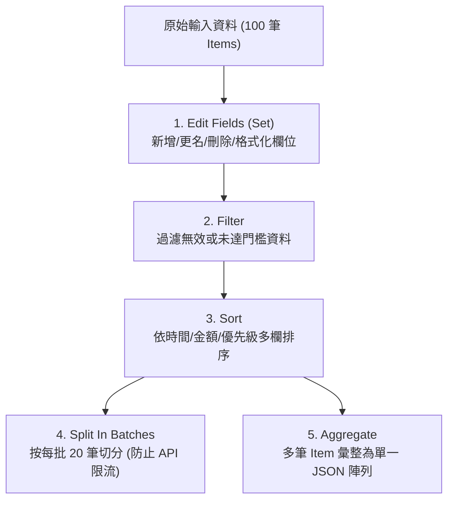

# 07. 資料轉換必備節點：Edit Fields, Filter, Sort, Aggregate, Split

在自動化管線中，超過 70% 的工作是在做資料清洗（ETL - Extract, Transform, Load）。n8n 提供了五大專用核心節點，讓工程師無需編寫繁瑣程式碼即可高效完成欄位映射、過濾、聚合與分批。

---

## 一、五大資料轉換節點總覽



---

## 二、Edit Fields (原 Set 節點之演進)

在舊版 n8n 中被稱為「Set」，在現代版本中全面升級為 **Edit Fields**。

### 2.1 核心操作模式
1. **Include Other Input Fields (包含其他原始欄位)**：
   - 開啟（預設）：在原始資料基礎上新增或修改指定欄位。
   - 關閉：**白名單模式**，僅保留你在設定面板中明確指定的欄位，其餘自動丟棄（非常適用於敏感個資脫敏或瘦身資料傳輸）。
2. **手動型別強制指定 (Type Casting)**：
   支援明確指定欄位型態為 String、Number、Boolean、Object 或 Array，自動完成格式轉換。


**欄位更名技巧**  
若想將外部 API 的 `user_registered_email_address` 簡化為 `email`：  
只需在 Edit Fields 中建立新欄位 `email`，賦值為 `{{ $json.user_registered_email_address }}`，並關閉「Include Other Input Fields」，即可乾淨俐落地產出標準化資料。


---

## 三、Filter (條件過濾器)

Filter 節點負責將不符合業務邏輯的項目攔截下來。

### 3.1 雙向輸出設計
現代 Filter 節點具備兩個輸出連接埠：
- **頂部綠色埠 (kept)**：符合條件的 Items。
- **底部灰色埠 (discarded)**：被剔除的 Items。
這種設計非常適合將未通過驗證的資料直接導流至「異常告警」或「日誌存檔」分支，無需再手動串接額外的 If 節點！

### 3.2 組合條件邏輯
支援 `AND`（全部符合）與 `OR`（任一符合）多條件組合，支援數值比對、正則表達式比對、陣列包含檢查與空值檢查（`is empty` / `is not empty`）。

---

## 四、Sort (多欄位排序器)

在呼叫報表或進行分頁處理前，通常需要按固定順序排序。
- 支援配置多重排序規則（例如：先按 `department` 升冪排，同部門再按 `salary` 降冪排）。
- 支援文字、數值與時間戳記排序。

---

## 五、Aggregate (項目聚合) 與 Split Out (陣列拆分)

這對節點構成了 n8n 處理「一對多」與「多對一」資料形態轉換的核心樞紐。

### 5.1 Aggregate (多筆轉單筆)
當上游產生 50 筆個別客戶的 Item 時，若下游的「發送報表 Email」節點直接連接，會瞬間寄出 50 封郵件！
- **解決方案**：在中間插入 **Aggregate** 節點。
- 它會將 50 個獨立 Item 聚合為 **1 個 Item**，其內部包含一個長度為 50 的陣列 `items: [...]`。
- 此外還支援「**Group by**」功能（例如：依據 `country` 分組聚合，將 50 筆資料轉換為 3 個國家的分組 Item）。

### 5.2 Split Out (單筆轉多筆)
反之，當外部 API 回傳結構如下：
```json
{
  "orderId": "ORD-2026",
  "products": [
    { "sku": "A1", "qty": 2 },
    { "sku": "B2", "qty": 1 }
  ]
}
```
使用 **Split Out** 節點指定欄位 `products`，引擎會立即將該筆資料炸開為 2 個平行的 Item，每個 Item 均保留原有 `orderId` 與各自獨立的產品明細。

---

## 六、Split In Batches (防 API 限流批次器)

當您需要一次發送 1,000 封促銷通知，但第三方 API 規範限制「每秒最多處理 10 個請求」時：

```mermaid
flowchart LR
    Start["1,000 筆 Items"] --> Split["Split In Batches<br/>設定 Batch Size = 10"]
    Split -->|輸出當前批次| HTTP["呼叫外部 API"]
    HTTP --> Wait["Wait 節點 (等待 1 秒)"]
    Wait -->|迴圈接回上側輸入埠| Split
    Split -->|所有批次處理完畢 (Done 埠)| Next["完成後續流程"]
```


透過 Split In Batches 搭配 Wait 節點建立的回圈，能以最優雅、最低記憶體負擔的方式穩定處理大規模資料。


在下一章中，我們將探討如何使用 **If** 與 **Switch** 節點實現靈活的流程邏輯分支。
