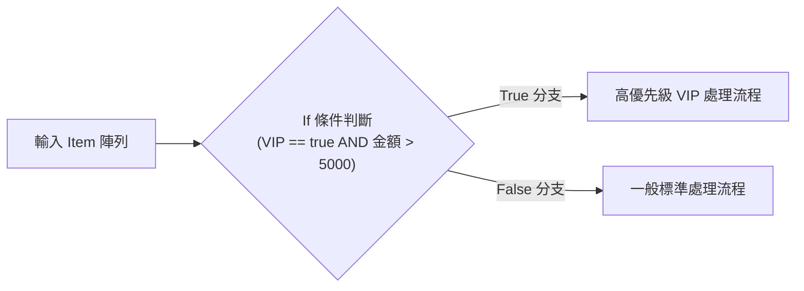
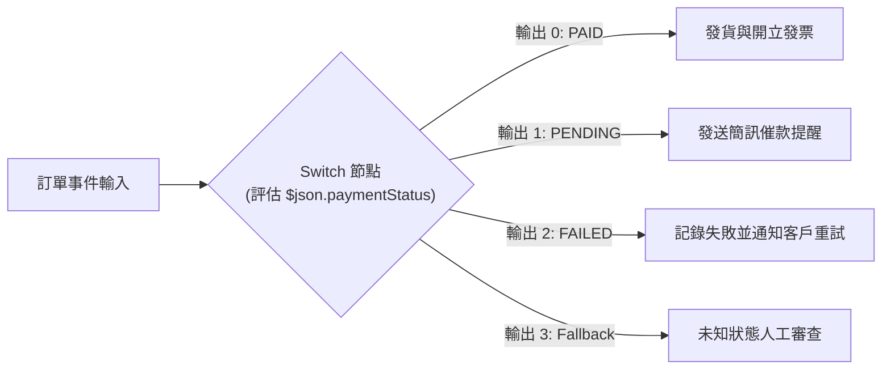
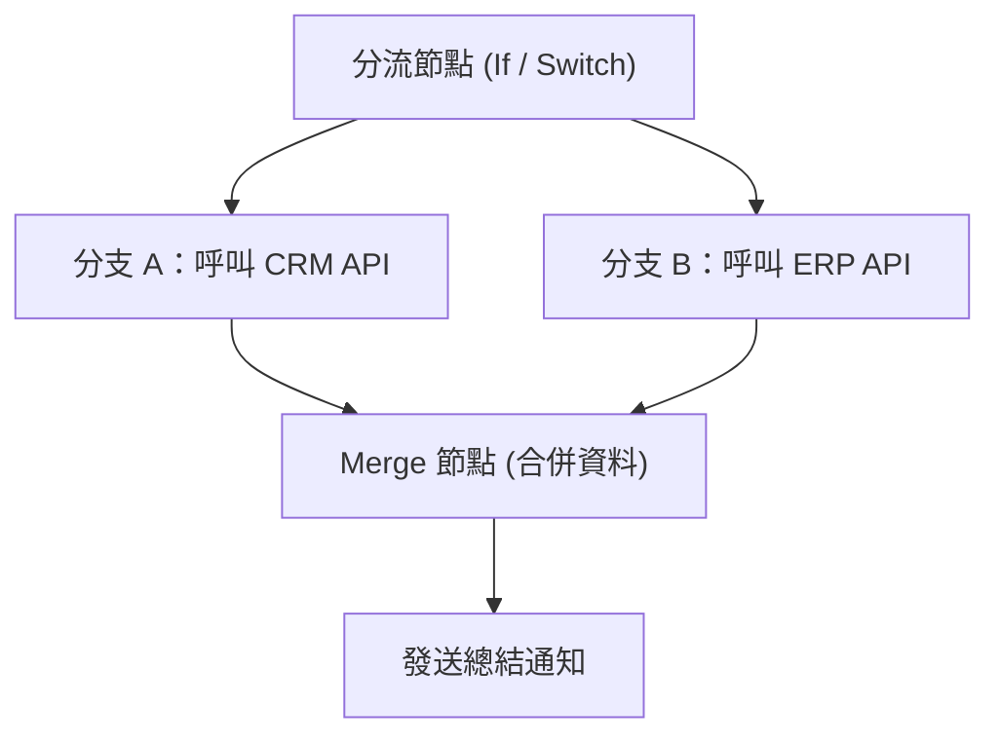

# 08. 條件控制與流程分支：If 條件評估與 Switch 模式匹配

複雜的業務邏輯絕非一條直線到底。根據使用者的等級、訂單狀態、錯誤代碼或權限角色，工作流必須動態分流至不同的處理路徑。n8n 提供了 **If** 與 **Switch** 兩大分支節點，並搭配 **Merge** 節點實現多路徑匯聚。

---

## 一、If 節點：二元邏輯分支

If 節點是工作流中最常用的條件判斷節點，具備 `true`（綠色頂部輸出）與 `false`（紅色底部輸出）兩個方向。



### 1.1 複合條件評估 (Condition Groups)
在現代 If 節點中，您可以自由建立多組條件，並透過「**AND (全部符合)**」與「**OR (任一符合)**」進行多層級嵌套評估：

```text
[Group 1]
  - $json.user.role EQUALS "Admin"
  OR
  - $json.user.department EQUALS "Security"
AND
[Group 2]
  - $json.action NOT_EQUALS "test_ping"
```

### 1.2 嚴格型別比對技巧
在比對數值與布林值時，請注意資料型別：
- 若資料來源為字串 `"100"`，使用數值運算子 `is greater than 50` 會自動嘗試轉型；但若比較布林值 `"true"`（字串）與 `true`（布林），可能造成評估偏誤。
- **最佳實踐**：在表達式中利用 JavaScript 強制標準化，例如 `{{ Boolean($json.isActive) }}`。

---

## 二、Switch 節點：多元路由模式匹配

當分支數量大於 2 個時（例如處理 HTTP 狀態碼、工單狀態或多國家語言分配），連續串接多個 If 節點會使畫布雜亂難以維護。此時 **Switch** 節點是最佳解決方案。



### 2.1 兩種運作模式



直觀地為每個輸出分支定義匹配規則：
- **Output 0**：`$json.country EQUALS "TW"`
- **Output 1**：`$json.country EQUALS "JP"`
- **Output 2**：`$json.country EQUALS "US"`
- **Fallback Output**：勾選「Include Fallback Output」，任何未匹配上述三者的項目會自動導向 Fallback 分支。



直接透過表達式計算出要導向的輸出埠編號（0, 1, 2...）：
```javascript
// 範例：依據風險分數分流 (0: 低風險, 1: 中風險, 2: 高風險)
{{ $json.riskScore > 80 ? 2 : ($json.riskScore > 40 ? 1 : 0) }}
```
此模式極為簡潔，特別適合演算法或權重計算後的動態分流。



---

## 三、分支匯聚：Merge 節點架構

分支執行完各自的專屬邏輯後，往往需要將資料重新合併，進行統一的存檔或通知。



### 3.1 常用 Merge 模式
1. **Choose Branch (選擇分支)**：
   等待其中一個指定分支完成，並僅採用該分支的資料。
2. **Combine (合併欄位 - 依索引或特定 Key)**：
   類似 SQL JOIN。例如以 `userId` 為關聯鍵，將分支 A 取得的使用者檔案與分支 B 取得的訂單記錄合併為一個完整的 Item。
3. **Wait for Both (等待雙方完成 - Append)**：
   等待所有分支均執行完畢後，將兩邊產出的 Items 串接在一起輸出。

---

## 四、本章總結

- 二元判斷優先使用 **If** 節點；三路以上或狀態碼分流優先使用 **Switch** 節點。
- 善用 Switch 的 **Fallback** 輸出作為防呆安全網，避免未知狀態資料遺失。
- 使用 **Merge** 節點進行非同步分支的有序匯聚與 SQL-like 資料融合。

在下一章中，我們將解鎖極致的靈活性——深入探討 **Code 節點的 JavaScript 與 Python 雙引擎實戰**！
