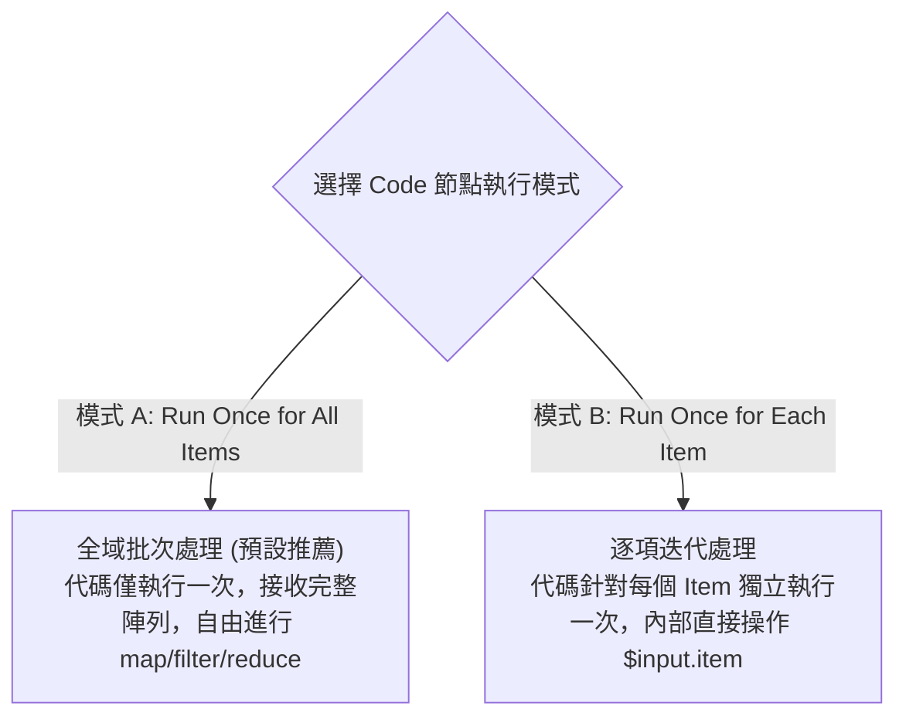

# 09. Code 節點進階：JavaScript 與 Python 雙引擎實戰

當內建節點無法滿足高度特化的演算法、複雜的正則分析、資料加密雜湊（HMAC）或深層資料扁平化時，**Code 節點** 就是工程師無所不能的終極瑞士刀。

在現代 n8n 中，Code 節點全面支援 **JavaScript (V8)** 與 **Python (Pyodide 容器沙盒)** 雙引擎，並且提供完整的輸入輸出介面與除錯視窗。

---

## 一、兩種執行模式 (Execution Mode)

在撰寫代碼前，首先必須在節點頂部確認執行模式：




**工程師最佳實踐推薦**  
絕大多數情況下推薦選擇 **Run Once for All Items**！這種模式不僅執行效率最高（避免多次啟動執行上下文），而且允許進行陣列去重、批次排序與全域統計。


---

## 二、JavaScript 引擎實戰

n8n 內建的 JavaScript 環境提供全套 ES2022+ 語法，並原生支援 `Buffer` 與 `crypto` 模組。

### 2.1 核心輸入與輸出規範
```javascript
// 取得所有輸入資料
const allItems = $input.all();

// 核心規範：必須返回一個由包含 { json: {...} } 物件組成的陣列
return allItems.map((item, index) => {
  return {
    json: {
      id: item.json.id,
      upperName: item.json.name.toUpperCase(),
      processedAt: new Date().toISOString()
    },
    // 維護 pairedItem 避免下游斷鏈！
    pairedItem: { item: index }
  };
});
```

### 2.2 實用案例：產生 HMAC-SHA256 簽名
對接第三方金流（如 LINE Pay、Stripe）時，常需以密鑰進行數位簽名：

```javascript
const crypto = require('crypto');

const secretKey = 'my_secret_api_key_2026';
const items = $input.all();

return items.map((item, index) => {
  const payload = JSON.stringify(item.json);
  
  // 計算 HMAC-SHA256 簽名
  const signature = crypto
    .createHmac('sha256', secretKey)
    .update(payload)
    .digest('hex');

  return {
    json: {
      ...item.json,
      signature: signature,
      timestamp: Date.now()
    },
    pairedItem: { item: index }
  };
});
```

---

## 三、Python 引擎實戰

對於資料科學家或 Python 愛好者，可直接在節點中切換語言為 **Python**。

### 3.1 核心語法與輸入介面
在 Python 模式中，輸入資料透過 `_input` 存取：
- `_input.all()`：傳回所有 Item 字典清單。
- `_input.first()`：傳回第一個 Item。

### 3.2 實用案例：資料扁平化與正則清洗
```python
import re

output = []

for idx, item in enumerate(_input.all()):
    raw_text = item.json.get("rawComment", "")
    
    # 使用 Python 正則提取所有 Email 與電話號碼
    emails = re.findall(r'[\w\.-]+@[\w\.-]+\.\w+', raw_text)
    phones = re.findall(r'\+?\d{2,4}[- ]?\d{3,4}[- ]?\d{3,4}', raw_text)
    
    output.append({
        "json": {
            "sourceId": item.json.get("id"),
            "extractedEmails": emails,
            "extractedPhones": phones,
            "hasContact": len(emails) > 0 or len(phones) > 0
        },
        "pairedItem": { "item": idx }
    })

return output
```

---

## 四、安全隔離與自訂外部套件載入

自 n8n 2.x 起，為防範惡意腳本與記憶體洩漏，所有 Code 節點預設運行於隔離沙盒（Task Runner）。



若您需要在 JavaScript 中使用特定的 npm 套件（例如 `lodash` 或 `axios`）：
1. 在 Docker Compose 環境變數中聲明允許載入的模組清單：
   ```yaml
   environment:
     - NODE_FUNCTION_ALLOW_EXTERNAL=lodash,moment,axios
   ```
2. 在容器中安裝該套件或掛載至 `/home/node/.n8n/custom-modules`。
3. 即可在 Code 節點中直接使用 `const _ = require('lodash');`。



Python 運行於 Pyodide 隔離環境，原生支援 Python 核心標準庫（`math`, `re`, `json`, `datetime`, `urllib` 等）。若需要高階科學計算（如 `numpy`），建議在外部微服務封裝後透過 HTTP Request 節點調用。



---

## 五、本章總結

- 優先選用 `Run Once for All Items` 模式以獲得最優效能與批次能力。
- 務必在回傳結構中封裝 `{ json: {...}, pairedItem: { item: index } }`。
- JavaScript 適合加解密與快速資料轉換；Python 適合文字正則解析與資料清洗。

在下一章中，我們將探討如何進行複雜資料的**迴圈批次迭代**，以及如何將龐大的工作流程拆解為可複用的**子工作流程 (Sub-workflows)**。
