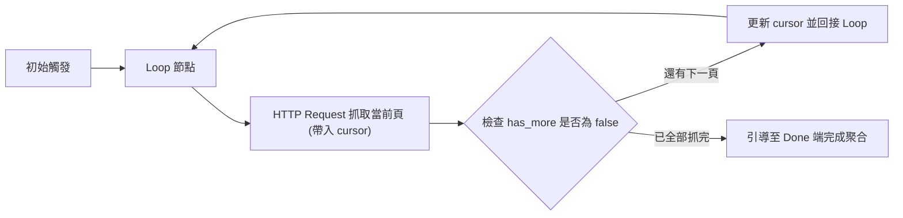

# 10. 迴圈處理與子工作流程（Loop Over Items & Sub-workflows）

當工作流程規模擴大時，若將數十個節點塞在同一張畫布上，將導致維護災難；同時，面對需要「分頁抓取 API」或「逐筆防禦性重試」的情境，我們需要標準化的**迴圈機制**與**子工作流程（Sub-workflows）模組化架構**。

---

## 一、隱式迴圈 vs 顯式迴圈

在深入學習前，必須先建立清楚的認知：

```mermaid
flowchart TD
    subgraph 隱式迴圈 (Implicit Loop)
        I1["上游輸出 50 筆 Items"] --> I2["Slack 節點自動對這 50 筆發送 50 次訊息"]
    end

    subgraph 顯式迴圈 (Explicit Loop)
        E1["輸入 50 筆 Items"] --> E2["Loop Over Items 節點 (逐筆或按批次切分)"]
        E2 -->|當前批次| E3["執行高風險任務或複雜多步計算"]
        E3 -->|回接| E2
        E2 -->|所有項目處理完畢 (Done)| E4["接續下游後續工作"]
    end
```

- **隱式迴圈**：絕大多數節點天生具備批次能力，資料直接穿透，速度最快。
- **顯式迴圈 (Loop Over Items)**：用於每一步執行後需要**動態檢查條件、防範第三方 API 限流（Rate Limiting）或分頁游標（Pagination）**的情境。

---

## 二、Loop Over Items 節點實戰

`Loop Over Items` 節點擁有兩個輸出端點：
1. **Loop 端口（上方輸出）**：輸出當前批次的項目，經過處理後必須連線**回接 (Loop back)** 到該節點的輸入端。
2. **Done 端口（下方輸出）**：當所有項目完成迭代後，流程由 Done 端繼續向下進行。

### 2.1 實務場景：API 分頁遍歷 (Cursor-based Pagination)
當調用 GitHub 或 Stripe API 時，資料是按頁傳回的（每頁附帶 `has_more: true` 與 `next_cursor`）：




**防範無限迴圈最佳實踐**  
在自建迴圈時，請務必在節點設定中設置**最大迭代次數上限 (Max Iterations)**（例如上限 50 次），以防止因第三方 API 回傳異常而耗盡伺服器 CPU！


---

## 三、子工作流程 (Sub-workflows) 模組化

軟體工程的第一準則即是「單一職責原則 (Single Responsibility Principle)」。  
透過 **Execute Workflow** 節點，我們可以將通用的邏輯（例如：發送多管道統一警報、解密驗證 Token、寫入稽核日誌）獨立為一個可複用的子流程。

```mermaid
flowchart TD
    subgraph 主工作流程：電商結帳
        M1["接收訂單 Webhook"] --> M2["Execute Workflow 呼叫：驗證庫存"]
        M2 --> M3["扣款處理"]
        M3 --> M4["Execute Workflow 呼叫：開立發票與寄送通知"]
    end

    subgraph 子工作流程：開立發票與寄送通知 (獨立維護)
        S1["Execute Workflow Trigger 接收參數"] --> S2["呼叫電子發票 API"]
        S2 --> S3["寄送發票 PDF Email"]
        S3 --> S4["傳回發票號碼給主流程"]
    end

    M4 -.->|調用| S1
    S4 -.->|回傳結果| M4
```

### 3.1 建立子流程的步驟 (Stepper)



### 步驟 1：建立子流程並配置入口節點
建立一個全新的工作流程，起始節點選擇 **When Executed by Another Workflow** (Execute Workflow Trigger)。此節點會自動接收主流程傳遞過來的 Item 陣列。



### 步驟 2：設計子流程專屬邏輯與回傳
在子流程末端，確保產出需要回傳給主流程的資料格式（例如 `{ invoiceNumber: "INV-2026-001", success: true }`）。



### 步驟 3：在主流程中配置 Execute Workflow 節點
在主流程中新增 **Execute Workflow** 節點：
- **Source**：選擇 Database（本機已儲存流程）或輸入 Workflow ID。
- **Workflow**：從下拉清單選中剛建立的子流程。
- **Mode**：選擇 `Each Item`（每個項目分別呼叫一次子流程）或 `All Items`（一次將整批陣列送入子流程批次處理）。



---

## 四、子流程的錯誤隔離優勢

當在主流程中呼叫外部子流程時，您可以利用 Execute Workflow 節點的「**Continue On Fail**」選項：
- 若子流程因非核心功能（例如寄送感謝信）發生網路超時，主流程**不會崩潰中斷**，主流程可捕獲該錯誤並記錄，繼續推進核心扣款交易。
- 這種設計能大幅縮小系統異常時的影響半徑（Blast Radius）。

---

## 五、本章總結

- 大批量資料配合條件防護使用 `Loop Over Items` 顯式迴圈。
- 超過 15 個節點的大型工作流程，應積極重構拆解為多個單一職責的 `Sub-workflows`。
- 子流程的解耦架構是企業級自動化系統兼具可讀性、複用性與高穩定度的核心設計模式。

在第四篇中，我們將跨出本地環境，深入掌握 **現代 HTTP Request、Webhook 安全防禦與憑證機密管理**！
