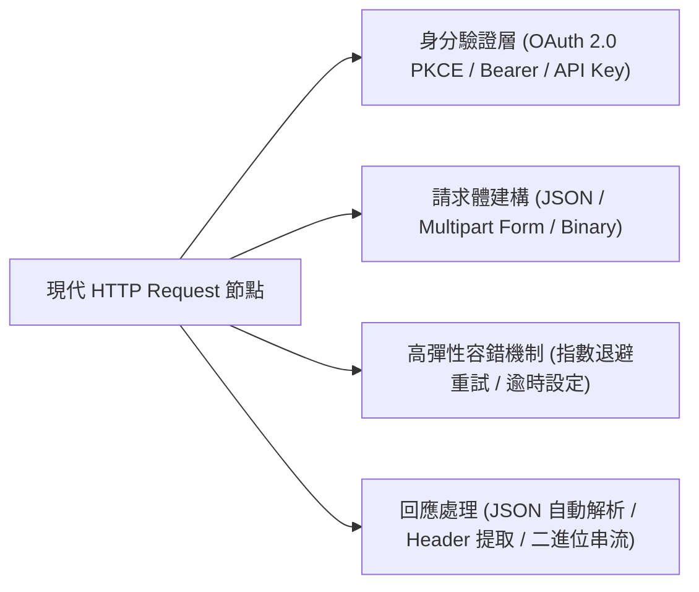
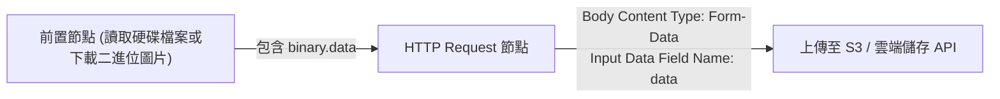

# 11. 現代 HTTP Request 節點深度實戰（OAuth 2.0 PKCE 與指數退避）

無論 n8n 社群提供了多少預建整合節點，真實世界中的私有微服務、內部 ERP 或最新的 SaaS API 依然需要透過標準的 HTTP 協定進行通訊。**HTTP Request 節點** 是整個自動化系統中呼叫外部 API 最頻繁、最核心的節點。

在 2026 年的版本中，HTTP Request 節點全面升級，原生支援了 **OAuth 2.0 PKCE 安全流**、**動態重試與指數退避 (Exponential Backoff)** 以及**多格式二進位上傳**。

---

## 一、節點核心架構與參數配置

---

## 二、企業級高可用容錯：指數退避重試 (Exponential Backoff)

在分散式系統中，外部 API 經常面臨短暫的網路抖動或因為頻率過高觸發 `429 Too Many Requests`。若直接中斷流程，將造成線上資料遺失。

### 2.1 啟用重試設定
在 HTTP Request 節點的 **Settings** 面板中，開啟以下選項：
1. **Retry on Fail (失敗時重試)**：設為 `true`。
2. **Max Tries (最大嘗試次數)**：建議設為 `3` ~ `5` 次。
3. **Wait Between Tries (重試間隔)**：設為 `2000` (毫秒)。
4. **Exponential Backoff**：開啟。間隔時間將依序按 2s, 4s, 8s, 16s 成倍遞增，大幅減緩下游伺服器負擔並提高重試成功率！


**永不報錯模式 (Never Error / Continue on Fail)**  
若該外部 API 可能回傳 `404 Not Found` 且這屬於您業務判斷的一部分（例如：檢查使用者是否存在）：  
請開啟 **Never Error** 或在 Response 設定中勾選「**Include Response Status and Headers**」。這樣 404 回應不會拋出例外中斷流程，下游節點可透過 `{{ $json.statusCode === 404 }}` 進行優雅的條件分流。


---

## 三、身分驗證模式 (Authentication) 深度剖析



針對現代高度安全的 OAuth 2.0 提供者（如 Google, Twitter, Slack）：
- 傳統 Authorization Code 流容易受授權碼攔截攻擊。
- 現代 n8n 原生整合 **PKCE (Proof Key for Code Exchange)**，自動於底層生成 `code_verifier` 與 `code_challenge`，並自動處理 Token 刷新（Refresh Token），開發者無需人工編寫任何換票邏輯。



最常見的 API 密鑰格式：
- 在 Authentication 選擇「Predefined Credential Type」或「Generic Credential Type」。
- 設定 Header 名稱：`Authorization`。
- Value：`Bearer {{ $env.MY_SERVICE_TOKEN }}`。
- 憑證一經儲存即以 AES-256 加密存入資料庫，工作流畫布與日誌中絕不洩漏明文！



針對需要每次請求均不同簽名（例如 AWS SigV4 或特定銀行 API）：
可在前置 Code 節點中計算好 Signature 與 Timestamp，直接透過表達式動態注入 Header：
`X-Custom-Sign: {{ $('Generate Signature').item.json.signature }}`。



---

## 四、檔案二進位資料上傳 (Multipart / Form-Data)

在處理圖片分析、PDF 報告上傳時，需要傳送二進位內容：

1. 在 HTTP Request 節點中將 **Send Body** 設為 `true`。
2. **Body Content Type** 選擇 `Multipart Form-Data`。
3. 增加 Parameter：選擇 `Binary File`，在 **Input Data Field Name** 輸入上游二進位欄位名稱（預設通常為 `data`）。
4. 引擎會自動組裝正確的 `boundary` 與 `Content-Type` 完成串流通訊。

---

## 五、本章總結

- 現代 HTTP Request 節點是通往外部世界的通用橋樑。
- 生產環境必須標配 **指數退避重試 (Exponential Backoff)** 提升抗脆弱性。
- 利用 PKCE 與加密憑證機制徹底隔絕敏感金鑰外洩風險。

在下一章中，我們將轉向被動監聽——探討 **Webhook 的接收架構與嚴密的安全防禦策略**。
