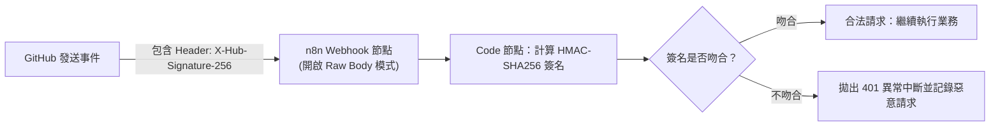

# 12. Webhook 整合與端點防護（CIDR 白名單與 HMAC 簽名）

Webhook 是實現事件驅動（Event-driven）自動化的核心機制。當第三方系統（如 Stripe、GitHub、Shopify）發生重要事件時，會向 n8n 的 Webhook 端點發送 HTTP POST 請求。然而，將端點暴露在公網上也意味著面臨惡意掃描、DDOS 與假造資料攻擊的風險。

本章將深入剖析 Webhook 的回應架構，以及在 2026 年最新版本中實施的嚴密防護措施。

---

## 一、三種 Webhook 回應模式 (Response Modes)

在 Webhook 節點的「**Respond**」設定中，有三種根本不同的回應策略：

```mermaid
flowchart TD
    subgraph 模式 A: Immediately (On Received)
        W1["收到 Webhook 請求"] -->|立即回傳 HTTP 200 OK| S1["第三方呼叫端 (Stripe/GitHub)"]
        W1 -->|非同步在背景執行後續耗時任務| T1["大資料處理 / 寄信 / AI 推理 (耗時 10 秒)"]
    end

    subgraph 模式 B: Using Respond to Webhook Node
        W2["收到 Webhook"] --> T2["前置驗證與簡單計算 (耗時 50ms)"]
        T2 --> RW["Respond to Webhook 節點<br/>(回傳 { status: 'accepted', taskId: 123 })"]
        RW -->|快速回覆用戶端| S2["用戶端"]
        RW --> T3["繼續執行耗時後續任務"]
    end
```


**防範第三方逾時 (Timeout 504) 規則**  
像 Stripe 或 GitHub 等平台，通常規定 Webhook 必須在 **3 到 5 秒內** 收到 HTTP 2xx 回應，否則會判定傳送失敗並觸發自動重試風暴！  
若後續工作流涉及 AI 推理或多個 API 串接（通常超過 5 秒），**絕對不可將 Respond 設為「When Last Node Finishes」**，務必採用 **Immediately** 或 **Respond to Webhook 節點** 立即回覆！


---

## 二、端點安全防護第一道防線：CIDR IP 白名單

自 n8n 2.x 起，Webhook 節點原生引入了 **CIDR IP 白名單限制** 功能。

### 2.1 配置步驟
在 Webhook 節點設定中：
1. 找到 **IP Whitelist / Allowed CIDRs**。
2. 輸入允許呼叫該端點的 IP 範圍（多組以逗號分隔）：
   ```text
   192.30.252.0/22, 185.199.108.0/22, 140.82.112.0/20
   ```
3. 任何非白名單內的 IP 請求，會在引擎最外層直接被攔截並回傳 `403 Forbidden`，完全不會進入工作流畫布，徹底抵禦惡意流量灌爆伺服器資源。

---

## 三、端點安全防護第二道防線：HMAC 數位簽名驗證

對於無法限制固定 IP 的場景，最權威的防護手法是**雜湊訊息驗證碼 (HMAC - Hash-based Message Authentication Code)**。第三方會在請求 Header 中帶入使用共同密鑰計算出的簽名（例如 GitHub 的 `X-Hub-Signature-256`）。



### 3.1 驗證簽名 Code 實作範例 (JavaScript)


**關鍵技巧：必須取得 Raw Body**  
在 Webhook 節點中，務必將 **Raw Body** 選項開啟，因為任何 JSON 格式化（反序列化再序列化）都可能因空格或排序微小差異導致簽名計算不一致！


```javascript
const crypto = require('crypto');

// 雙方共享的 Webhook 密鑰
const secret = 'webhook_secret_key_from_dashboard';

const rawBody = $input.first().json.rawBody; // 由 Webhook 節點傳入的原始未變動字串
const incomingSignature = $('Webhook').first().json.headers['x-hub-signature-256'];

// 1. 本地計算期望的簽名
const expectedSignature = 'sha256=' + crypto
  .createHmac('sha256', secret)
  .update(rawBody)
  .digest('hex');

// 2. 使用安全時間恆定比較 (避免時序攻擊 Timing Attack)
const isValid = crypto.timingSafeEqual(
  Buffer.from(incomingSignature || ''),
  Buffer.from(expectedSignature)
);

if (!isValid) {
  throw new Error('SECURITY VIOLATION: Invalid HMAC signature detected!');
}

return [{ json: { verified: true, payload: $input.first().json.body } }];
```

---

## 四、本章總結

- 面對長任務，務必採用 **Immediately** 或 **Respond to Webhook** 模式防止 504 逾時。
- 結合 **CIDR IP 白名單** 與 **HMAC 簽名驗證**，構建無懈可擊的 Webhook 零信任安全體系。

在下一章中，我們將探討如何安全管理整套系統中最敏感的核心資產——**API 憑證與機密金鑰管理**。
