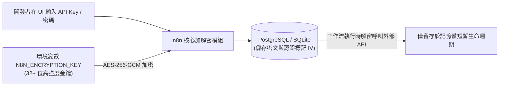

# 13. 憑證與機密管理最佳實踐（加密金鑰與外部 Secret Store）

在企業自動化架構中，n8n 往往手握整個組織各項關鍵系統的最高權限（例如 AWS 存取金鑰、Stripe 私鑰、資料庫連線字串及企業 Slack Bot Token）。若機密管理不當，將對企業安全造成毀滅性打擊。

本章將剖析 n8n 憑證儲存的底層加密原理、日誌脫敏機制，以及如何與外部企業級 Secret Store 整合。

---

## 一、憑證底層加密架構：N8N_ENCRYPTION_KEY




**永不遺失金鑰法則**  
n8n 在資料庫中所儲存的所有憑證，都是使用啟動時傳入的 `N8N_ENCRYPTION_KEY` 進行 AES-256 加密的。  
- 若伺服器重啟或遷移時沒有保留此環境變數，資料庫內所有的憑證將**永久無法被解密**！
- **最佳實踐**：將 `N8N_ENCRYPTION_KEY` 保存於企業密碼庫（如 1Password、Bitwarden 或 AWS Secrets Manager），絕不提交進 Git 倉庫。


---

## 二、日誌自動脫敏與機密保護機制

在除錯複雜工作流時，開發者常需要檢視 Executions 歷史日誌。  
- **自動脫敏 (Credential Masking)**：所有綁定於 Credentials 面板中的欄位，在日誌顯示與 API 回應中均會被自動遮蔽為 `********`。
- **避免硬編碼反面教材**：
  ```javascript
  // ❌ 極度危險反面教材：在 Code 節點或 Edit Fields 寫死明文密鑰
  const apiKey = "sk-proj-9988223344556677"; // 任何人檢視歷史執行記錄都會直接看到明文！

  // ✅ 安全最佳實踐：透過 Credentials 系統或環境變數注入
  const apiKey = $env.SECURE_OPENAI_API_KEY;
  ```

---

## 三、團隊協同與專案權限隔絕 (RBAC)

自 n8n 1.x 與 2.x 起，引入了多用戶與專案隔離體系（Project & Role-Based Access Control）：

| 角色層級 | 憑證權限說明 |
| :--- | :--- |
| **Instance Owner (系統擁有者)** | 管理全域加密金鑰、設定企業外掛與管理員指派 |
| **Project Admin (專案管理員)** | 在該專案空間內建立、授權共用憑證 |
| **Workflow Editor (流程編輯者)** | **僅能使用**專案內已授權的憑證進行工作流開發，**無法查看**底層密碼或密鑰明文 |

這種設計讓開發團隊能自由測試自動化流程，同時又嚴格保護生產憑證不被基層人員任意複製攜出。

---

## 四、整合外部企業級 Secret Store

對於金融業與高資安要求組織，可將 n8n 銜接外部密鑰管理中心：



在企業環境中配置 Vault Agent，於 n8n 啟動時動態將最新 Token 與密鑰注入環境變數容器檔案中，實現定期自動輪轉（Credential Rotation）。



可透過前置腳本或專屬擴充節點，在工作流執行初期動態呼叫 AWS Secrets Manager 取得暫時性 STS 憑證，用完隨即在記憶體中釋放，達成完全零靜態金鑰（Zero-Static-Credentials）架構。



---

## 五、本章總結

- `N8N_ENCRYPTION_KEY` 是憑證資料庫的命脈，必須嚴密備份與持久化。
- 絕不在畫布或腳本中硬編碼任何明文密鑰，統一使用 Credentials 面板或 `$env` 參照。
- 善用專案角色隔離，確保非核心團隊人員「可調用憑證、不可檢視明文」。

在即將到來的第五篇，我們將邁入全書最激動人心的核心領域——**2026 現代 AI Agent 架構與智慧編排深度實踐**！
