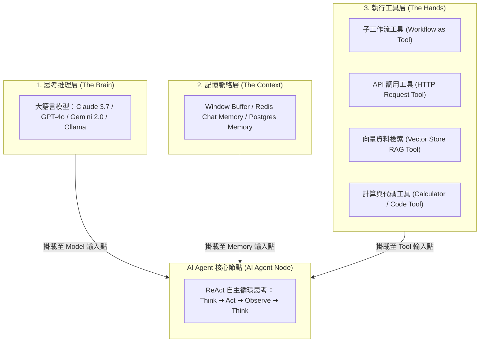
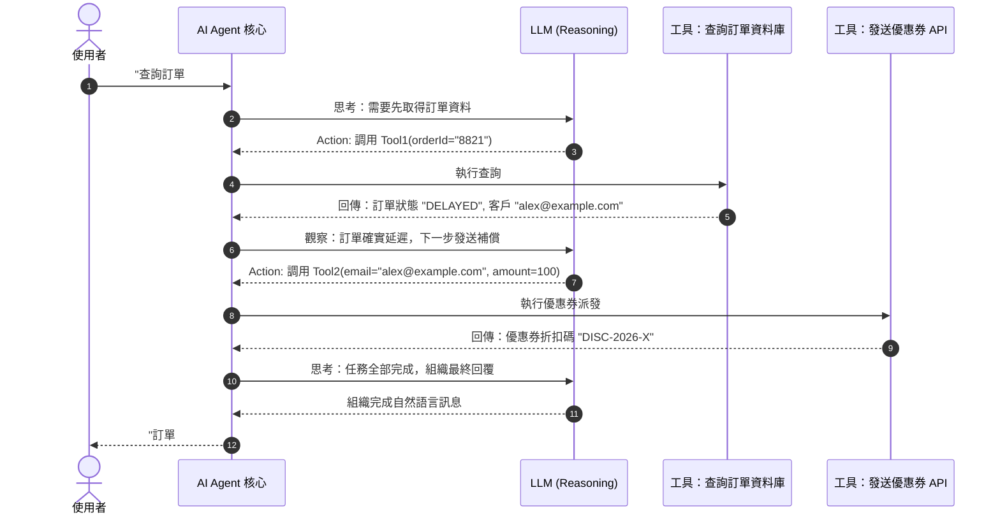

# 14. AI Agent 核心架構：Reasoning + Memory + Tools 三層結構

在 2026 年，大語言模型（LLM）的應用已從早期的「提示詞工程（Prompt Engineering）」演進為真正的「**自主代理人（Autonomous Agent）**」。單純的問答模型只能給出建議，而 AI Agent 則具備「目標拆解、觀察環境、自主選擇工具、評估結果並修正路徑」的閉環行動能力。

n8n 透過深度整合 LangChain 體系，在空間畫布上將 AI Agent 的抽象架構可視化為清晰的**三層結構（Three-Tier Architecture）**。

---

## 一、AI Agent 三層架構深度拆解

### 1.1 思考推理層 (Reasoning Layer - 大腦)
- 負責接收使用者的自然語言任務，根據系統提示詞（System Prompt）與目前狀態進行推理。
- 支援各大頂級 LLM 服務商，模型需要具備極高的指令遵循力（Instruction Following）與原生 Tool Calling（函數調用）能力。

### 1.2 記憶脈絡層 (Memory Layer - 記憶)
- 解決 LLM 天生無狀態（Stateless）的問題。
- **Window Buffer Memory**：保存在記憶體中，適合單次對話前後 10 輪上下文追蹤。
- **Postgres / Redis Chat Memory**：將對話歷史依據 `Session ID` 持久化於資料庫，即便使用者隔天再次開啟對話，Agent 仍能調取歷史對話記錄。

### 1.3 執行工具層 (Tool Layer - 雙手)
- 這是 n8n 相比其他純 AI 平台的最大護城河。
- **500+ 種現成整合節點與子流程均可封裝為 Tool**！Agent 可以自行決定在何時查詢資料庫、發布 GitHub Issue、向財務發送 Slack 確認、或呼叫內部的微服務。

---

## 二、ReAct 思考循環（Reasoning + Acting）機制

當使用者向 Agent 提出問題：「*幫我查詢訂單 #8821 的物流狀態，若已延遲，則發送補償優惠券給客戶。*」

---

## 三、防止死循環與成本防護 (Guardrails & Limits)

自主代理人雖然強大，但若提示詞模糊或工具回應異常，極易陷入「重複調用工具」的無限死循環，導致 API 費用暴增。


**三大生產級防護設定**  
1. **Max Iterations (最大迭代次數)**：在 AI Agent 節點中，務必將 Max Iterations 限制在 **5 到 10 次**。若超過上限仍未得出結果，強制中斷並返回錯誤。
2. **Temperature (隨機度)**：涉及呼叫 Tool 的任務，建議將 Temperature 調低至 **0.0 ~ 0.2**，以保證函式參數輸出的確定性與格式正確性。
3. **Token Usage Logging**：在節點中開啟使用量追蹤，每次執行自動記錄 Prompt Tokens 與 Completion Tokens，方便進行財務成本審計。


---

## 四、本章總結

- AI Agent 是由 **思考 (LLM) + 記憶 (Memory) + 工具 (Tools)** 組成的自適應系統。
- n8n 的視覺化畫布讓 ReAct 循環的每一個思考步驟（Thoughts）、調用參數（Tool Inputs）與觀察結果（Observations）都 100% 透明可審計。
- 嚴格設定最大迭代次數與低隨機度是生產環境安全落地的首要防線。

在下一章中，我們將實戰探討各大主流 LLM（Claude Thinking Mode、GPT-4o、Gemini FileSearch 與地端 Ollama）的接入與原生 Tool Calling 配置！
