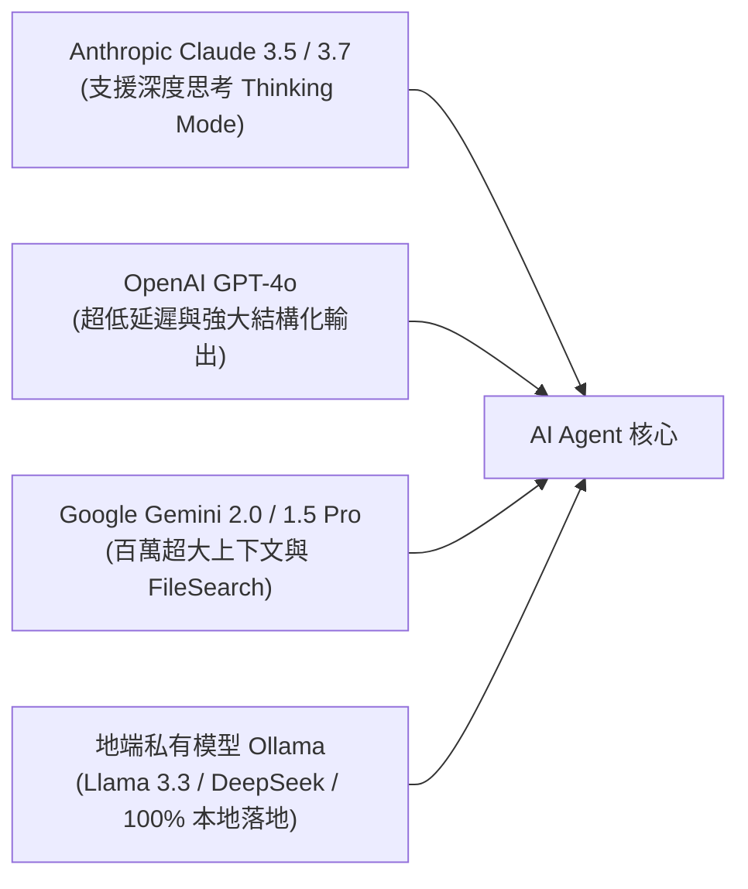

# 15. LLM 模型接入與原生 Tool Calling（Claude, GPT-4o, Gemini, Ollama）

在早期 AI 整合中，開發者常透過 Prompt 要求 LLM「請回傳指定 JSON 格式」，再透過正則表達式艱難地解析輸出，極易因模型產生微小語法錯誤（幻覺）導致工作流中斷。  
進入 2026 年，現代主流模型均已支援硬體層級的 **原生 Tool Calling (Function Calling)** 與 **結構化輸出 (Structured Outputs)**。

本章將帶您實戰接入主流大模型，並學習如何為 Agent 設計高精準度的自訂工具。

---

## 一、主流模型接入與特色橫向比較

在 n8n 的畫布中，您可以將以下任何模型節點直接連線至 AI Agent 的「Model」輸入埠：



### 1.1 模型特徵選型指南

| 服務提供商 | 推薦模型 | 核心優勢 | 最適用場景 |
| :--- | :--- | :--- | :--- |
| **Anthropic** | `claude-3-7-sonnet` | 支援 **Thinking Mode (鏈式推理)**，程式碼與邏輯最縝密 | 複雜多步驟規劃、長程式碼重構 |
| **OpenAI** | `gpt-4o` / `gpt-4o-mini` | 原生 Structured Outputs，Tool Calling 延遲最低 | 企業即時對話、高頻微服務工具編排 |
| **Google** | `gemini-2.0-flash` / `gemini-1.5-pro` | 1M~2M 超大上下文、原生整合 Google 搜尋與 FileSearch | 大型合約文件審閱、跨多個 PDF 跨模態分析 |
| **Ollama** | `llama3.3:70b` / `mistral` | 完全運行於內部 Docker 容器，無任何資料外流風險 | 醫療、金融等高度合規與私有內網環境 |



在 Claude 節點設定中開啟「Enable Thinking」：
- 模型會在調用 Tool 或產出最終回覆前，輸出一段結構化的 `<thinking>` 思維鏈。
- 在 n8n 畫布的執行歷史中，您可以逐字檢視模型的推理心路歷程，大幅降低黑盒除錯難度。



若需完全隱私：
1. 啟動 Ollama 容器並拉取模型：`ollama pull llama3.3`。
2. 在 n8n 的 Ollama 節點中，Base URL 設定為 `http://ollama:11434`。
3. 即可在完全斷網環境下運作具備 Tool Calling 能力的本機 Agent！



---

## 二、將工作流封裝為 Tool (Workflow as Tool)

在 n8n 中，最優雅且威力最強大的工具模式就是 **Workflow as Tool**。您可以將一個包含十多個節點的複雜業務流程（例如：查詢 SAP、發送審批信件、寫入 PostgreSQL），封裝為 AI Agent 眼中的一個簡單工具！

```mermaid
flowchart TD
    subgraph 主 Agent 流程
        A["AI Agent"] -->|掛載| WT["Workflow as Tool 節點<br/>名稱: query_inventory<br/>描述: 傳入 SKU，向倉庫 ERP 查詢即時庫存數量"]
    end

    subgraph 獨立子工作流程 (ERP 查詢)
        T["When Executed by Another Workflow"] --> SAP["SAP 連線節點"]
        SAP --> Clean["清洗庫存狀態"]
        Clean --> Ret["返回 { inStock: true, count: 120 }"]
    end

    WT -.->|動態調用| T
    Ret -.->|回傳 JSON| WT
```

### 2.1 工具 Prompt 定義的黃金法則
LLM 之所以能準確決定何時調用某個工具，完全取決於您在工具節點上編寫的**名稱 (Name)** 與**描述 (Description)**：

- **Tool Name**：使用 snake_case，語意明確（例如：`fetch_customer_crm_profile`，避免模糊的 `tool1`）。
- **Tool Description**：清晰說明工具的用途、觸發條件與限制。
  ```text
  【最佳描述範例】
  當使用者詢問特定客戶的會員等級、歷史消費金額或退貨記錄時調用此工具。
  輸入參數必須包含有效的 email 或 customer_id。若找不到客戶，此工具將回傳 null。
  ```

---

## 三、自訂代碼工具 (Custom Code Tool)

若不需要調用子工作流，僅需進行演算法轉換或快速查詢：  
可直接在畫布新增 **Custom Code Tool** 節點，定義傳入參數的 JSON Schema（例如 `temperature_celsius: number`），並在內部編寫 Python 或 JavaScript 執行即時計算。

---

## 四、本章總結

- 2026 年是原生 Tool Calling 與結構化輸出的時代，徹底告別傳統文字正則提取。
- 善用 Claude 的 Thinking Mode 進行深度推理，Gemini 進行海量文檔檢索，Ollama 實現地端隱私合規。
- 將複雜子工作流封裝為 `Workflow as Tool`，是建構高內聚、低耦合企業 AI 系統的最核心心法。

在下一章中，我們將探討如何讓 Agent 擁有企業內部知識庫——**企業級 RAG 實戰與向量資料庫整合**！
