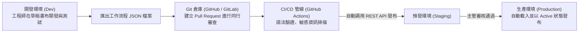

# 21. 工作流程版本控制與 CI/CD（Git Sync 與 REST API 自動化）

在成熟的工程組織中，「禁止直接在生產環境畫布上修改代碼」是一條鐵律。自動化工作流本質上就是業務代碼（Workflow as Code），必須經歷「**本機開發 ➔ Git 提交 ➔ 程式碼審查 (Code Review) ➔ CI/CD 自動發布至測試與生產環境**」的標準軟體生命週期。

本章將詳解如何運用 **n8n REST API** 與 **Git Sync** 建構完整的自動化交付管線。

---

## 一、Workflow as Code 的現代生命週期



---

## 二、透過 n8n 公開 REST API 實現程式化部署

n8n 提供了完整的管理級 REST API，允許外部 CI/CD 腳本直接以程式化方式管理工作流程。

### 2.1 啟用 API 與取得 API Key
1. 進入 n8n 前台，點擊 **Settings** -> **n8n API**。
2. 點擊 **Create an API Key**，複製生成的憑證金鑰。
3. 支援的主要 API 端點包括：
   - `GET /api/v1/workflows`：列出所有工作流及狀態。
   - `GET /api/v1/workflows/{id}`：匯出特定工作流程的完整 JSON 定義。
   - `POST /api/v1/workflows`：在該環境建立全新工作流程。
   - `PUT /api/v1/workflows/{id}`：更新現有工作流程（發布新版本）。
   - `POST /api/v1/workflows/{id}/activate`：將工作流程設為已啟用（Active）。

### 2.2 GitHub Actions 自動部署範本
當開發者將工作流 JSON 檔案合入 `main` 分支時，自動部署至生產環境：

```yaml
name: Deploy Workflows to Production

on:
  push:
    branches:
      - main
    paths:
      - 'workflows/**.json'

jobs:
  deploy:
    runs-on: ubuntu-latest
    steps:
      - name: Checkout Code
        uses: actions/checkout@v4

      - name: Deploy Modified Workflows
        env:
          N8N_BASE_URL: https://n8n.yourcompany.com
          N8N_API_KEY: ${{ secrets.N8N_PROD_API_KEY }}
        run: |
          for file in workflows/*.json; do
            echo "Deploying $file..."
            # 讀取 JSON 並呼叫 n8n API 進行發布更新
            curl -s -X POST "$N8N_BASE_URL/api/v1/workflows" \
              -H "X-N8N-API-KEY: $N8N_API_KEY" \
              -H "Content-Type: application/json" \
              -d @"$file"
          done
```

---

## 三、環境變數與跨環境設定解耦 (Variables)

當同一個工作流從 Dev 遷移至 Prod 時，資料庫主機名稱或第三方 API URL 必然不同。**切忌在畫布節點中寫死環境相關字串**！

- 在 n8n 左側導航列進入 **Variables**。
- 定義鍵值變數，例如 `ORDER_API_ENDPOINT`：
  - 開發環境中其值為 `https://dev-api.internal.net`
  - 生產環境中其值為 `https://prod-api.company.com`
- 在畫布節點中一律以現代表達式引用：`{{ $vars.ORDER_API_ENDPOINT }}`。
- 工作流 JSON 檔案在任何環境遷移時均可「零修改」直接通用！

---

## 四、本地 CLI 批次備份與匯出指令

在 Docker 容器內，n8n CLI 提供了快速批次備份工具：

```bash
# 匯出全部工作流至容器內指定目錄
docker exec -it n8n-server n8n export:workflow --all --output=/home/node/.n8n/workflows-backup.json

# 匯出所有憑證定義 (不含明文密鑰)
docker exec -it n8n-server n8n export:credentials --all --output=/home/node/.n8n/credentials-backup.json
```

---

## 五、本章總結

- 實踐 Workflow as Code，以 Git 倉庫作為團隊自動化邏輯的單一真實來源（Single Source of Truth）。
- 結合 GitHub Actions 與 **n8n REST API** 實現零手動干預的自動化交付。
- 善用 **Variables** 實現工作流程代碼與環境配置的完美解耦。

恭喜您完成了全書核心概念與系統工程的學習！在接下來的第七篇中，我們將把所有技能融會貫通，展開三個震撼的**企業級實戰專案 Cookbook**！
