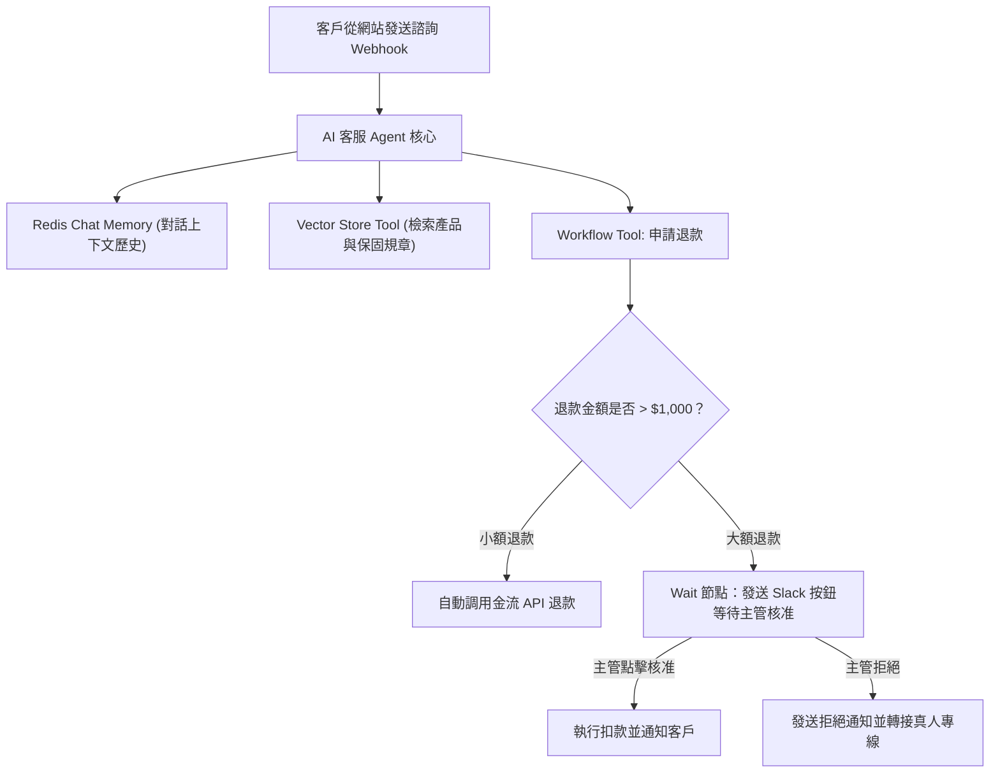

# 22. 案例一：全自動智慧客服（RAG 知識庫問答 + 敏感操作主管審批）

在現代客戶支援系統中，客戶期望 7x24 小時即時解答，但企業又不能承擔 AI 幻覺亂承諾賠償的風險。本專案將打造一個兼具**專業知識檢索（RAG）**與**人機審核（HITL）**的生產級客服機器人。

配套工作流檔案：[`workflows/02-ai-agent-rag-support.json`](file:///home/cosmo_chang/Projects/n8n-beginner-guide/workflows/02-ai-agent-rag-support.json)

---

## 一、系統架構藍圖



---

## 二、核心節點配置步驟 (Stepper)



### 步驟 1：建立 Webhook 對話入口
- **節點**：Webhook
- **HTTP Method**：`POST`
- **Path**：`customer-support-chat`
- **Respond**：`Using 'Respond to Webhook' Node`（確保能自訂回傳 JSON）。



### 步驟 2：掛載記憶與 RAG 工具至 AI Agent
- **節點**：AI Agent (Tools Agent 模式)。
- **Prompt**：
  ```text
  你是一家科技產品電商的頂級客服專家。
  1. 優先調用 RAG 知識庫回答使用者的產品規格、退換貨政策與技術問題。
  2. 若客戶要求退款，詢問其訂單編號與退款理由，並調用 apply_refund 工具。
  3. 若知識庫無法解答，請誠實告知並主動提供真人專線 (0800-000-123)。
  ```
- **Tools 依賴**：
  - 掛載 **Postgres Vector Store Tool** 供內部 FAQ 檢索。
  - 掛載 **Workflow as Tool** (`apply_refund`) 執行退款流程。



### 步驟 3：退款審核子流程與 Wait 節點
在 `apply_refund` 子工作流程中：
- 使用 **If 節點** 判斷金額：`{{ $json.amount > 1000 }}`。
- 大額退款分支連接 **Slack 節點** 發送審批卡片，內含 `{{ $execution.resumeUrl }}`。
- 緊接 **Wait 節點**（Resume on Webhook call）。
- 收到主管批准回調後，透過 Stripe API 完成退款動作。



---

## 三、實測效果與成果

- **自動化率**：常規 FAQ 諮詢 95% 由 RAG 直接在 1.5 秒內精確解答並給出引據來源。
- **風險防禦**：退款等財務操作 100% 納入主管稽核軌跡，兼顧極致效率與資安治理。
