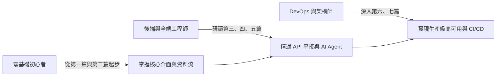

# n8n 2026 全方位實戰指南：從零基礎入門到企業級 AI Agent 自動化編排

> **Definitive Guide to n8n Automation & AI Agent Orchestration (2026 Edition)**  
> 適用版本：`n8n v2.x` / `v3.x` 生產標準 ｜ 部署標準：Docker & Docker Compose ｜ 繁體中文開源規範

---

## 📖 為什麼需要這本書？

自動化領域在 2025 至 2026 年迎來了翻天覆地的架構典範轉移。  
過往，自動化主要聚焦於「觸發 A、查詢 B、傳送到 C」的固定鏈式（Linear Chaining）邏輯；而在 2026 年，隨著 **n8n 2.x 與 3.x** 的推出，n8n 已從單純的工作流自動化工具，躍升為**現代企業級 AI Agent 智慧編排中心**。

### 2026 年 n8n 核心重大變革
1. **草稿與發布機制（Save vs Publish）**：徹底告別舊版編輯即影響線上生產的風險，全面導入審查發布流與版本回滾（Rollback）。
2. **AI Agent 原生架構**：不再需要複雜的副工作流拼湊， Reasoning（LLM）、Memory（向量與快取記憶）與 Tools（外掛工具）成為一等公民節點。
3. **全面 Docker 化部署標準**：2026 年起官方正式棄用裸機 `npm install` 部署，全面轉向容器化隔離與安全 Task Runner。
4. **效能與儲存引擎革新**：原生全面優化 PostgreSQL 高併發佇列與連線池，移除舊版 MySQL 相容層。
5. **Item Linking 現代資料流**：深入底層的 `pairedItem` 追溯機制，從根源根除大型資料轉換時的表達式斷鏈難題。

本書嚴格遵循 **GitBook 最佳文檔實踐規範**，不僅提供循序漸進的觀念解析，更附帶了可立即運行的 **Docker Compose 範本** 與 **可匯入工作流 JSON**，旨在成為技術人員桌邊最具權威性、最實用的現代自動化參考指針。

---

## 🎯 目標受眾與先備知識

本書設計為不同層次的工程師量身打造：

- **初學者與自動化專員**：無須深厚程式背景，跟隨指南手把手從空間畫布操作、條件判斷到第一個 Webhook 自動化。
- **後端與整合工程師**：深入研究 JavaScript/Python 雙引擎 Code 節點、OAuth 2.0 PKCE 驗證與微服務串接。
- **AI 應用工程師**：系統化掌握 LangChain 原生節點、多 Agent 協調架構、RAG 向量檢索與 Human-in-the-Loop 審批流程。
- **SRE / DevOps 工程師**：實踐 Redis Queue Mode 橫向擴展、Prometheus 指標告警、資料定期清理與 Git Sync CI/CD 遷移。

---

## 🗺️ 全書架構與章節概覽

本書由淺入深分為七大核心篇章與實用附錄：

* [**第一篇：邁入現代自動化世界 (Getting Started)**](01-getting-started/01-n8n-overview.md)
  * 什麼是 n8n？2026 現代自動化全貌與核心架構
  * 快速起步：Docker 與 Docker Compose 一鍵部署
  * 全新空間畫布與介面導覽（草稿、發布與自動儲存）
* [**第二篇：n8n 核心觀念與資料流架構 (Core Concepts)**](02-core-concepts/01-data-structure.md)
  * 核心資料結構：Array of JSON Objects 與 pairedItem 溯源機制
  * 節點分類與觸發機制（Webhook、Cron、Polling、Error Trigger）
  * 現代表達式語法與 Luxon 時間處理實戰
* [**第三篇：邏輯控制與資料轉換實戰 (Workflow Logic)**](03-workflow-logic/01-data-transformation.md)
  * 資料轉換必備節點：Edit Fields, Filter, Sort, Aggregate, Split
  * 條件控制與流程分支：If 條件評估與 Switch 模式匹配
  * Code 節點進階：JavaScript 與 Python 雙引擎實戰
  * 迴圈處理與子工作流程（Loop Over Items & Sub-workflows）
* [**第四篇：外部整合與 API 通訊 (API & Integrations)**](04-api-and-integrations/01-http-request-node.md)
  * 現代 HTTP Request 節點深度實戰（OAuth 2.0 PKCE 與指數退避）
  * Webhook 整合與端點防護（CIDR 白名單與 HMAC 簽名）
  * 憑證與機密管理最佳實踐（加密金鑰與外部 Secret Store）
* [**第五篇：2026 現代 AI Agent 與智慧編排 (AI Agents Orchestration)**](05-ai-agents-orchestration/01-ai-agent-fundamentals.md)
  * AI Agent 核心架構：Reasoning + Memory + Tools 三層結構
  * LLM 模型接入與原生 Tool Calling（Claude, GPT-4o, Gemini, Ollama）
  * 企業級 RAG 實戰：向量資料庫整合（PGVector / Qdrant）
  * 多 Agent 協作與 Human-in-the-Loop 人機協同
* [**第六篇：生產環境運維與企業級架構 (DevOps & Production)**](06-devops-and-production/01-production-deployment.md)
  * 生產級 Docker Compose 架構：PostgreSQL 連線池優化
  * 高併發擴展：Redis Queue Mode 實戰
  * 監控告警與日誌審計（Prometheus、健康檢查與 Data Pruning）
  * 工作流程版本控制與 CI/CD（Git Sync 與 REST API 自動化）
* [**第七篇：企業實戰專案食譜 (Practical Cookbook)**](07-practical-cookbook/01-case-ai-customer-care.md)
  * 案例一：全自動智慧客服（RAG 知識庫問答 + 敏感操作主管審批）
  * 案例二：高容錯 ETL 資料管道（多來源採集 + 批次清洗 + 重試機制）
  * 案例三：DevOps 智慧監控與自愈工作流（Sentry 警報聚合與通知）
* [**附錄 (Appendices)**](appendices/appendix-a-troubleshooting.md)
  * 附錄 A：常見錯誤代碼與除錯速查手冊
  * 附錄 B：完整 Docker Compose 與生產設定檔清單
  * 附錄 C：本書 GitBook 規範與開源貢獻指南

---

## 🛠️ 配套程式碼與實例目錄

在本書程式碼倉庫中，提供以下可直接運行的工程級資源：

| 目錄 | 說明 |
| :--- | :--- |
| [`docker/`](file:///home/cosmo_chang/Projects/n8n-beginner-guide/docker) | 包含單節點入門版、生產級 Redis Queue Mode Compose 檔案及環境變數示範 |
| [`workflows/`](file:///home/cosmo_chang/Projects/n8n-beginner-guide/workflows) | 隨書案例標準工作流程 JSON，可在 n8n 畫布中直接複製貼上匯入 |
| [`scripts/`](file:///home/cosmo_chang/Projects/n8n-beginner-guide/scripts) | 文檔結構完整性檢查與鏈接自動化測試腳本 |

---

## 💡 如何閱讀這本書？

- 每個專章均包含**核心理論解析**、**交互式圖解（Mermaid）**、**節點配置參數表**以及**可複制的代碼區塊**。
- 若您看到帶有 `` 或 `> [!NOTE]` 的提示塊，代表該處為官方文檔中極易踩坑的關鍵細節，請特別留意。
- 您可以點擊左側目錄循序漸進閱讀，亦可透過右上角搜尋框快速檢索具體節點或錯誤代碼。

---

## 📄 授權條款 (License)

> 本作品內容由 AI 輔助全面生成，並由專案發起人進行架構設計與彙整發布。本作品採用 創用 CC 姓名標示-非商業性 4.0 國際授權條款 (CC BY-NC 4.0) 與 MIT 授權條款釋出。

本書採用**雙授權（Dual-Licensing）模式**：
- **電子書與教學內容**：採用 [CC BY-NC 4.0](https://creativecommons.org/licenses/by-nc/4.0/deed.zh-hant)（創用 CC 姓名標示-非商業性 4.0 國際授權條款）釋出。歡迎自由閱讀、分享與非商業改作，但**未經原作者書面授權，嚴禁任何形式之商業營利、付費轉載或集結出版**。
- **範例代碼、工作流程與配置**：位於 [`workflows/`](workflows)、[`docker/`](docker) 與 [`scripts/`](scripts) 中之程式碼及設定檔，均採用寬鬆的 [MIT License](LICENSE) 授權，讀者可自由在個人或企業內部專案中無痛引用與部署。

### ⚠️ 免責與商標聲明
- **技術免責**：本作品包含之配置參數與代碼範例僅供學習參考，投入生產環境前請務必於沙盒環境充分測試。作者與貢獻者不承擔任何直接或間接之營運或業務損失責任。
- **商標聲明**：`n8n` 為 n8n GmbH 之註冊商標。本書為社群獨立維護之開源學習手冊，非 n8n 官方贊助、附屬或背書之專案。

### 📖 引用本手冊 (Citation)
若您在文章、教材或專案中引用本書內容，請依 CC 規範標註出處：
> Cosmo Chang, *n8n 2026 全方位實戰指南：從零基礎入門到企業級 AI Agent 自動化編排*, 2026. GitHub: https://github.com/cosmo-chang-1701/n8n-beginner-guide

