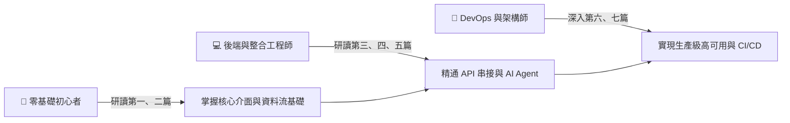

# n8n 2026 全方位實戰指南：從零基礎入門到企業級 AI Agent 自動化編排

<p align="center">
  <strong>Definitive Guide to n8n Automation & AI Agent Orchestration (2026 Edition)</strong><br>
  現代化開源工作流編排 ｜ AI Agent 原生架構 ｜ 企業級生產運維 ｜ 繁體中文標準指南
</p>

<p align="center">
  <a href="https://semantic-cosmos.gitbook.io/n8n-beginners-guide/"></a>
</p>

<p align="center">
  <a href="https://n8n.io"></a>
  <a href="LICENSE"></a>
  <a href="LICENSE"></a>
  <a href="https://docs.docker.com"></a>
  
  <a href="https://github.com/cosmo-chang-1701/n8n-beginner-guide/stargazers"></a>
  <a href="https://github.com/cosmo-chang-1701/n8n-beginner-guide/network/members"></a>
  <a href="https://github.com/cosmo-chang-1701/n8n-beginner-guide/pulls"></a>
</p>

<p align="center">
  <a href="https://semantic-cosmos.gitbook.io/n8n-beginners-guide/">📖 <strong>GitBook 在線閱讀</strong></a> •
  <a href="#-5-分鐘快速上手-quick-start">🚀 <strong>快速上手</strong></a> •
  <a href="#-全書章節導覽-curriculum">🗺️ <strong>完整目錄</strong></a> •
  <a href="#-隨書實例與資源庫-resources">📦 <strong>工作流庫</strong></a> •
  <a href="#-開源貢獻與社群-contributing">🤝 <strong>開源貢獻</strong></a> •
  <a href="https://github.com/cosmo-chang-1701/n8n-beginner-guide/issues">💬 <strong>問題反饋</strong></a>
</p>

---

## 📑 目錄 (Table of Contents)

- [📖 為什麼需要這本書？](#-為什麼需要這本書)
  - [2026 年 n8n 核心重大變革](#2026-年-n8n-核心重大變革)
- [✨ 專案核心亮點 (Key Highlights)](#-專案核心亮點-key-highlights)
- [🎯 目標受眾與學習路徑 (Learning Paths)](#-目標受眾與學習路徑-learning-paths)
- [🚀 5 分鐘快速上手 (Quick Start)](#-5-分鐘快速上手-quick-start)
  - [路徑一：線上即時閱覽 (推薦)](#路徑一線上即時閱覽-推薦)
  - [路徑二：一鍵啟動本地 n8n 實驗環境](#路徑二一鍵啟動本地-n8n-實驗環境)
  - [路徑三：本地離線閱讀與 HonKit 伺服](#路徑三本地離線閱讀與-honkit-伺服)
- [🗺️ 全書章節導覽 (Curriculum)](#-全書章節導覽-curriculum)
- [📦 隨書實例與資源庫 (Resources)](#-隨書實例與資源庫-resources)
  - [可匯入工作流程範本 (Workflows)](#可匯入工作流程範本-workflows)
  - [Docker 部署範本 (Compose)](#docker-部署範本-compose)
- [🛠️ 本地開發與自動化校驗 (Local Development)](#️-本地開發與自動化校驗-local-development)
- [🤝 開源貢獻與社群 (Contributing)](#-開源貢獻與社群-contributing)
- [📄 授權條款、學術引用與免責聲明](#-授權條款學術引用與免責聲明)

---

## 📖 為什麼需要這本書？

自動化領域在 2025 至 2026 年迎來了翻天覆地的架構典範轉移。  
過往，自動化主要聚焦於「觸發 A、查詢 B、傳送到 C」的固定鏈式（Linear Chaining）邏輯；而在 2026 年，隨著 **n8n 2.x 與 3.x** 的推出，n8n 已從單純的工作流自動化工具，躍升為**現代企業級 AI Agent 智慧編排中心**。

### 2026 年 n8n 核心重大變革
1. **草稿與發布機制（Save vs Publish）**：告別編輯即影響線上生產環境的風險，全面導入審查發布流與版本回滾（Rollback）。
2. **AI Agent 原生架構**：不再需要複雜的子工作流拼湊，Reasoning（LLM 思考）、Memory（向量與快取記憶）與 Tools（外掛工具）成為標準一等公民節點。
3. **全面 Docker 化部署標準**：官方正式棄用裸機 `npm install` 部署，全面轉向容器化隔離與安全 Task Runner 執行環境。
4. **效能與儲存引擎革新**：原生全面優化 PostgreSQL 高併發佇列與連線池，移除舊版 MySQL 相容層。
5. **Item Linking 現代資料流**：深入底層的 `pairedItem` 追溯機制，從根源解決大型批次資料轉換時表達式斷鏈的痛點。

本書嚴格遵循 **GitBook 最佳文檔實踐規範**，不僅提供循序漸進的觀念解析，更附帶了可立即運行的 **Docker Compose 範本** 與 **可匯入工作流 JSON**，旨在成為技術人員桌邊最具權威性、最實用的現代自動化參考手冊。

---

## ✨ 專案核心亮點 (Key Highlights)

| 特色維度 | 說明 |
| :--- | :--- |
| 🆕 **2026 現代標準** | 全面基於 n8n v2.x / v3.x 規範編寫，涵蓋新版草稿發布機制、Task Runners 與安全性沙盒架構 |
| 🤖 **AI Agent 原生編排** | 深入解析 LangChain 節點、Function Calling、PGVector / Qdrant RAG 知識庫與 Human-in-the-Loop 人機審批 |
| 🐳 **生產級容器維運** | 提供開箱即用的單節點 PostgreSQL 實例與 Redis Queue Mode 橫向擴展叢集配置，支援 Prometheus 監控告警 |
| 💼 **真實企業食譜** | 附帶 3 大實戰場景完整 JSON 工作流（智慧客服 Agent、高容錯 ETL 管道、DevOps 事件自愈），複製即可上線 |
| 📚 **全繁體中文系統化** | 由淺入深分為 7 大篇章、24 個主題章節與 3 個附錄，提供清晰平緩的學習階梯與工程實戰準則 |

---

## 🎯 目標受眾與學習路徑 (Learning Paths)

本書為不同階段與職能的技術人員量身打造：



- **初學者與自動化專員**：無須深厚程式背景，跟隨指南手把手從空間畫布操作、條件分支判斷到第一個 Webhook 自動化。
- **後端與整合工程師**：深入研究 JavaScript/Python 雙引擎 Code 節點、OAuth 2.0 PKCE 驗證與微服務資料管道。
- **AI 應用工程師**：系統化掌握 LangChain 原生節點、多 Agent 協調調度、RAG 向量檢索與 Human-in-the-Loop 審批流程。
- **SRE / DevOps 工程師**：實踐 Redis Queue Mode 橫向擴展、Prometheus 指標告警、資料定期清理與 Git Sync CI/CD 遷移。

---

## 🚀 5 分鐘快速上手 (Quick Start)

### 路徑一：線上即時閱覽 (推薦)
造訪官方託管之 GitBook 專區，享受最佳排版、全域即時檢索與深色模式支援：
👉 **[https://semantic-cosmos.gitbook.io/n8n-beginners-guide/](https://semantic-cosmos.gitbook.io/n8n-beginners-guide/)**

---

### 路徑二：一鍵啟動本地 n8n 實驗環境
本專案已備妥開箱即用的單節點 PostgreSQL + n8n 容器配置：

```bash
# 1. 複製專案庫
git clone https://github.com/cosmo-chang-1701/n8n-beginner-guide.git
cd n8n-beginner-guide

# 2. 複製環境變數範本並視需要微調
cp docker/.env.example docker/.env

# 3. 透過 Docker Compose 一鍵啟動單節點服務
docker compose -f docker/docker-compose.single.yml up -d
```

啟動完成後，開啟瀏覽器造訪 `http://localhost:5678` 即可開始探索 n8n！

> [!TIP]
> 如需部署高併發的生產級叢集（含 Redis Queue Worker 擴展），請參閱 [第六篇：生產環境運維](06-devops-and-production/01-production-deployment.md) 與 [`docker/docker-compose.queue.yml`](docker/docker-compose.queue.yml)。

---

### 路徑三：本地離線閱讀與 HonKit 伺服
若您希望在本地端啟動離線電子書預覽：

```bash
# 1. 安裝依賴套件
npm install

# 2. 執行文檔結構自動化驗證
npm test

# 3. 啟動 HonKit 本地即時預覽伺服器
npm run serve:honkit
```
瀏覽器造訪 `http://localhost:4000` 即可預覽完整書籍內容。

---

## 🗺️ 全書章節導覽 (Curriculum)

全書包含 7 大核心篇章、24 個主題章節與 3 個附錄，所有章節均可在 GitHub 直接點閱或在 [GitBook 線上平台](https://semantic-cosmos.gitbook.io/n8n-beginners-guide/) 閱讀：

### [第一篇：邁入現代自動化世界 (Getting Started)](01-getting-started/01-n8n-overview.md)
* [01. 什麼是 n8n？2026 現代自動化全貌與核心架構](01-getting-started/01-n8n-overview.md) `n8n 概念` `架構`
* [02. 快速起步：Docker 與 Docker Compose 一鍵部署](01-getting-started/02-docker-quickstart.md) `Docker` `環境搭建`
* [03. 全新空間畫布與介面導覽（草稿、發布與自動儲存）](01-getting-started/03-canvas-and-editor.md) `UI 導覽` `Save vs Publish`

### [第二篇：n8n 核心觀念與資料流架構 (Core Concepts)](02-core-concepts/01-data-structure.md)
* [04. 核心資料結構：Array of JSON Objects 與 pairedItem 溯源機制](02-core-concepts/01-data-structure.md) `JSON Array` `pairedItem`
* [05. 節點分類與觸發機制（Webhook、Cron、Polling、Error Trigger）](02-core-concepts/02-triggers-and-nodes.md) `Trigger` `Polling`
* [06. 現代表達式語法與 Luxon 時間處理實戰](02-core-concepts/03-expressions-and-luxon.md) `Expressions` `Luxon`

### [第三篇：邏輯控制與資料轉換實戰 (Workflow Logic)](03-workflow-logic/01-data-transformation.md)
* [07. 資料轉換必備節點：Edit Fields, Filter, Sort, Aggregate, Split](03-workflow-logic/01-data-transformation.md) `Data Transform`
* [08. 條件控制與流程分支：If 條件評估與 Switch 模式匹配](03-workflow-logic/02-conditional-branching.md) `If` `Switch`
* [09. Code 節點進階：JavaScript 與 Python 雙引擎實戰](03-workflow-logic/03-code-node-mastery.md) `JavaScript` `Python`
* [10. 迴圈處理與子工作流程（Loop Over Items & Sub-workflows）](03-workflow-logic/04-loops-and-subworkflows.md) `Loops` `Sub-workflows`

### [第四篇：外部整合與 API 通訊 (API & Integrations)](04-api-and-integrations/01-http-request-node.md)
* [11. 現代 HTTP Request 節點深度實戰（OAuth 2.0 PKCE 與指數退避）](04-api-and-integrations/01-http-request-node.md) `HTTP Request` `OAuth 2.0`
* [12. Webhook 整合與端點防護（CIDR 白名單與 HMAC 簽名）](04-api-and-integrations/02-webhooks-and-security.md) `Webhook` `HMAC` `安全性`
* [13. 憑證與機密管理最佳實踐（加密金鑰與外部 Secret Store）](04-api-and-integrations/03-credentials-management.md) `Credentials` `Secrets`

### [第五篇：2026 現代 AI Agent 與智慧編排 (AI Agents Orchestration)](05-ai-agents-orchestration/01-ai-agent-fundamentals.md)
* [14. AI Agent 核心架構：Reasoning + Memory + Tools 三層結構](05-ai-agents-orchestration/01-ai-agent-fundamentals.md) `AI Agent` `LangChain`
* [15. LLM 模型接入與原生 Tool Calling（Claude, GPT-4o, Gemini, Ollama）](05-ai-agents-orchestration/02-llm-and-tool-calling.md) `Tool Calling` `LLMs`
* [16. 企業級 RAG 實戰：向量資料庫整合（PGVector / Qdrant）](05-ai-agents-orchestration/03-rag-and-vector-stores.md) `RAG` `PGVector` `Qdrant`
* [17. 多 Agent 協作與 Human-in-the-Loop 人機協同](05-ai-agents-orchestration/04-multi-agent-and-hitl.md) `Multi-Agent` `HITL 審批`

### [第六篇：生產環境運維與企業級架構 (DevOps & Production)](06-devops-and-production/01-production-deployment.md)
* [18. 生產級 Docker Compose 架構：PostgreSQL 連線池優化](06-devops-and-production/01-production-deployment.md) `PostgreSQL` `Connection Pool`
* [19. 高併發擴展：Redis Queue Mode 實戰](06-devops-and-production/02-queue-mode-scaling.md) `Redis Queue` `橫向擴展`
* [20. 監控告警與日誌審計（Prometheus、健康檢查與 Data Pruning）](06-devops-and-production/03-monitoring-and-logging.md) `Prometheus` `Data Pruning`
* [21. 工作流程版本控制與 CI/CD（Git Sync 與 REST API 自動化）](06-devops-and-production/04-cicd-and-git-sync.md) `CI/CD` `Git Sync`

### [第七篇：企業實戰專案食譜 (Practical Cookbook)](07-practical-cookbook/01-case-ai-customer-care.md)
* [22. 案例一：全自動智慧客服（RAG 知識庫問答 + 敏感操作主管審批）](07-practical-cookbook/01-case-ai-customer-care.md) `實戰案例` `AI 客服`
* [23. 案例二：高容錯 ETL 資料管道（多來源採集 + 批次清洗 + 重試機制）](07-practical-cookbook/02-case-etl-data-pipeline.md) `實戰案例` `ETL 管道`
* [24. 案例三：DevOps 智慧監控與自愈工作流（Sentry 警報聚合與通知）](07-practical-cookbook/03-case-devops-automation.md) `實戰案例` `Sentry` `自動自愈`

### [附錄 (Appendices)](appendices/appendix-a-troubleshooting.md)
* [附錄 A：常見錯誤代碼與除錯速查手冊](appendices/appendix-a-troubleshooting.md) `除錯手冊` `錯誤碼`
* [附錄 B：完整 Docker Compose 與生產設定檔清單](appendices/appendix-b-docker-compose.md) `生產設定檔` `環境變數清單`
* [附錄 C：本書 GitBook 規範與開源貢獻指南](appendices/appendix-c-gitbook-standards.md) `排版規範` `貢獻流程`

---

## 📦 隨書實例與資源庫 (Resources)

### 可匯入工作流程範本 (Workflows)
隨書隨附的 JSON 工作流程均經過沙盒實機測試，在 n8n 畫布中直接複製文字貼上即可完整還原節點配置：

| 檔案名稱 | 核心節點技術 | 應用場景說明 |
| :--- | :--- | :--- |
| [`01-basic-webhook-etl.json`](workflows/01-basic-webhook-etl.json) | Webhook, Edit Fields, Filter, SplitInBatches, Postgres | 高容錯電商訂單 Webhook 資料清洗管道，含批次處理與重試機制 |
| [`02-ai-agent-rag-support.json`](workflows/02-ai-agent-rag-support.json) | AI Agent, PGVector, OpenAI/Claude, Slack Approval | 企業智慧客服 RAG 問答機器人，附帶敏感退款動作 Human-in-the-Loop 主管審批流 |
| [`03-devops-incident-bot.json`](workflows/03-devops-incident-bot.json) | Webhook, Switch, HTTP Request, Sentry, Discord/Slack | DevOps 監控告警聚合機器人，自動分析嚴重層級並執行 API 重啟自愈 |

---

### Docker 部署範本 (Compose)

| 檔案路徑 | 適用情境 | 特性重點 |
| :--- | :--- | :--- |
| [`docker/docker-compose.single.yml`](docker/docker-compose.single.yml) | 本地學習、概念驗證 (PoC) | 包含 PostgreSQL 16 Alpine 與單節點 n8n，具備輕量健康檢查機制 |
| [`docker/docker-compose.queue.yml`](docker/docker-compose.queue.yml) | 企業生產級、高併發環境 | Redis 7 佇列模式、Webhook Worker 與多副本背景任務處理器 (Workers) 分離 |
| [`docker/.env.example`](docker/.env.example) | 環境變數安全示範 | 資料庫連線池、加密金鑰（`N8N_ENCRYPTION_KEY`）與執行紀錄定期修剪配置 |

---

## 🛠️ 本地開發與自動化校驗 (Local Development)

本專案採用自動化腳本確保所有章節連結、標籤閉合度與 Markdown 語法無瑕疵：

```bash
# 執行 GitBook 結構校驗（檢查 28 個章節與附錄完整性）
npm test

# 執行 HonKit 靜態網站建置測試
npm run build:honkit
```

專案包含自定義檢測腳本 [`scripts/validate_gitbook.js`](scripts/validate_gitbook.js)，能自動掃描 `SUMMARY.md` 中所有章節路徑、代碼區塊對稱性以及 GitBook 專用標籤（``、``、``）。

---

## 🤝 開源貢獻與社群 (Contributing)

我們非常歡迎任何形式的社群貢獻！無論是回報錯字、更新過時節點參數，或是提交新的企業級實戰食譜。

### 貢獻流程
1. **Fork 本專案庫** 到您的 GitHub 帳號。
2. **建立專屬分支**：`git checkout -b feature/amazing-recipe` 或 `git checkout -b fix/typo-chapter-05`。
3. **編寫與驗證**：請詳閱 [附錄 C：本書 GitBook 規範與開源貢獻指南](appendices/appendix-c-gitbook-standards.md)，並在提交前運行 `npm test` 通過所有測試。
4. **提交變更**：使用語義化 Commit 訊息（如 `docs: 補充 第 16 章 PGVector 索引優化參數說明`）。
5. **發起 Pull Request**：清楚描述改動背景與效果，我們將盡速審閱並合併！

---

## 📄 授權條款、學術引用與免責聲明

### 授權條款 (Dual License)
本專案採用**雙授權（Dual-Licensing）模式**：
- **文檔與電子書內容**：採用 [CC BY-NC 4.0](https://creativecommons.org/licenses/by-nc/4.0/deed.zh-hant)（創用 CC 姓名標示-非商業性 4.0 國際授權條款）釋出。歡迎自由閱讀、分享與非商業改作，但**未經原作者書面授權，嚴禁任何形式之商業營利、付費轉載或集結出版**。
- **範例代碼、工作流程與配置**：位於 [`workflows/`](workflows)、[`docker/`](docker) 與 [`scripts/`](scripts) 中之程式碼及設定檔，均採用寬鬆的 [MIT License](LICENSE) 授權，讀者可自由在個人或企業內部專案中無痛引用與部署。

### 📖 學術與技術引用 (Citation)
若您在文章、教材、演講或專案中引用本書內容，請依 CC 規範標註出處：

```bibtex
@book{chang2026n8n,
  title     = {n8n 2026 全方位實戰指南：從零基礎入門到企業級 AI Agent 自動化編排},
  author    = {Chang, Cosmo},
  year      = {2026},
  publisher = {GitBook},
  url       = {https://semantic-cosmos.gitbook.io/n8n-beginners-guide/},
  note      = {GitHub: https://github.com/cosmo-chang-1701/n8n-beginner-guide}
}
```

**文字引用格式**：
> Cosmo Chang, *n8n 2026 全方位實戰指南：從零基礎入門到企業級 AI Agent 自動化編排*, 2026. 在線閱讀：https://semantic-cosmos.gitbook.io/n8n-beginners-guide/

### ⚠️ 免責與商標聲明
- **技術免責**：本作品包含之配置參數與代碼範例僅供學習參考，投入生產環境前請務必於沙盒環境充分測試。作者與貢獻者不承擔任何直接或間接之營運或業務損失責任。
- **商標聲明**：`n8n` 為 n8n GmbH 之註冊商標。本書為社群獨立維護之開源學習手冊，非 n8n 官方贊助、附屬或背書之專案。
